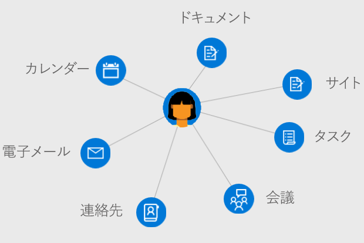

# Microsoft Graph におけるユーザーの概要Overview of users in Microsoft Graph

ユーザーは、Microsoft Graph における Azure Active Directory (Azure AD) の職場または学校のユーザー アカウント、または Microsoft アカウントの表現です。Users are the representation of an Azure Active Directory (Azure AD) work or school user account or a Microsoft account in Microsoft Graph. Microsoft Graph の **user** リソースは、ユーザーと関連性のあるリレーションシップやリソースにアクセスする際に使用できるハブです。The **user** resource in Microsoft Graph is a hub from which you can access the relationships and resources that are relevant to your users.

## ユーザー中心のアプリケーションを開発するDevelop user-centric applications

Microsoft Graph を使用して、サインインしているユーザーと文脈上関連性のあるリレーションシップ、ドキュメント、連絡先、およびユーザー設定にアクセスできます。You can use Microsoft Graph to access the relationships, documents, contacts, and preferences that are contextually relevant to the signed-in user. **user** リソースを使用すると、追加の呼び出しを実行せずにユーザー リソースにアクセスして操作したり、特定の認証情報を調べたり、他の Microsoft Graph リソースに対して直接クエリを発行したりできます。The **user** resource provides straightforward way for you to access and manipulate user resources without having to perform additional calls, look up specific authentication information, and directly issue queries against other Microsoft Graph resources.

ユーザーの情報やデータにアクセスするには、[ユーザーの代わりにアクセスを取得する](auth-v2-user.md)必要があります。To access a user's information and data, you'll need to [get access on their behalf](auth-v2-user.md). [管理者の同意](permissions-reference.md)を得てアプリケーションを認証することにより、ユーザーに関連する幅広いエンティティを操作および更新できます。Authenticating your application with [admin consent](permissions-reference.md) enables you to work with and update a wider range of entities associated with a user.

### 組織の管理Manage your organization

組織内に新しいユーザーを作成したり、既存のユーザーのリソースやリレーションシップを更新したりします。Create new users in your organization or update the resources and relationships for existing users. Microsoft Graph を使用して、次のユーザー管理タスクを実行できます。You can use Microsoft Graph to perform the following user management tasks: 

- 作成または Azure AD 組織内のユーザーを作成または削除する。Create or delete users in your Azure AD organization.
- ユーザーのグループ メンバーシップを一覧表示し、ユーザーがグループのメンバーであるかどうかを確認する。List a user's group memberships and determine whether a user is a member of a group.
- ユーザーへの報告やユーザーへの管理者の割り当てを行うユーザーを一覧表示する。List the users who report to a user and assign managers to a user.
- ユーザーの写真をアップロードまたは取得する。Upload or retrieve a photo for the user.

### 予定表とタスクの操作Work with calendars and tasks

ユーザーの予定表やユーザーに関連付けられている予定表グループを表示、照会、更新できます。次のような操作が含まれます。You can view, query, and update user calendar and calendar groups associated with a user, including:

- ユーザーの予定表でイベントを一覧表示し、作成する。List and create events on a users calendar.
- ユーザーに割り当てられたタスクを表示する。View tasks assigned to a user.
- 一連のユーザーのために空いている会議時間を検索する。Find free meeting times for a set of users.
- ユーザーの予定表に設定されたリマインダーの一覧を取得する。Get a list of reminders set on a user's calendar.

### メールの管理と連絡先の処理Administer mail and handle contacts

ユーザーのメール設定と連絡先リストを構成し、ユーザーの代わりにメールを送信できます。次のような操作が含まれます。You can configure user mail settings and contact lists and send mail on a user's behalf, including:

- メール メッセージを一覧表示し、新しいメールを送信する。List mail messages and send new mail.
- ユーザーの連絡先を作成および一覧表示し、連絡先をフォルダーに整理する。Create and list user contacts and organize contacts in folders.
- メールボックスのフォルダーと設定を取得し、更新する。Retrieve and update mailbox folders and settings.

### ユーザーのインサイトを使用したアプリの強化Enrich your app with user insights

ユーザーに関連するドキュメントや連絡先のうち、最近使用したものや人気上昇中のものを奨励することで、アプリケーションの関連性を最大化します。Maximize relevance in your application by promoting recently used or trending documents and contacts associated with a user. Microsoft Graph を使用して次のことができます。You can use Microsoft Graph to:

- ユーザーが最近表示および変更したドキュメントを返す。Return documents recently viewed and modified by a user.
- ユーザーのアクティビティで人気上昇中のドキュメントやサイトを返す。Return documents and sites trending around a user's activity.
- ユーザーがメールや OneDrive for Business で共有しているドキュメントを一覧表示する。List documents shared with a user through email or OneDrive for Business.

## API リファレンスAPI reference
このサービスの API リファレンスをお探しですか?Looking for the API reference for this service?

- [Microsoft Graph v1.0 の Users APIUsers API in Microsoft Graph v1.0](/graph/api/resources/users?view=graph-rest-1.0)
- [Microsoft Graph ベータ版の Users APIUsers API in Microsoft Graph beta](/graph/api/resources/users?view=graph-rest-beta)

## 次のステップNext steps

- [ユーザーの操作](/graph/api/resources/users?view=graph-rest-1.0)方法の詳細を確認するLearn more about how to [work with users](/graph/api/resources/users?view=graph-rest-1.0).
- [Graph エクスプローラー](https://developer.microsoft.com/graph/graph-explorer)の **user** リソースを使用して自分自身のデータを調べるExplore your own data from the **user** resource in the [Graph Explorer](https://developer.microsoft.com/graph/graph-explorer).
- [ユーザーの代わりに](auth-v2-user.md)、または[管理者の同意を得てデーモンまたはサービスとして](auth-v2-service.md) Microsoft Graph を使用して認証します。Authenticate with Microsoft Graph [on behalf of a user](auth-v2-user.md) or [as a daemon or service by consent of an administator](auth-v2-service.md).
- [Azure AD API](/graph/api/resources/azure-ad-overview?view=graph-rest-1.0) を使用してユーザーのアクセス制御とポリシーを設定するSet access control and policies for users with the [Azure AD API](/graph/api/resources/azure-ad-overview?view=graph-rest-1.0).
- アプリからユーザー データにアクセスするために必要な[権限](permissions-reference.md)を確認するReview the [permissions](permissions-reference.md) your app will need to access user data. 
<!-- This isn't really a next step; let's remove to keep the list of links concise.>
- Stay up to date with Microsoft Graph [changelog](changelog.md).
-->
