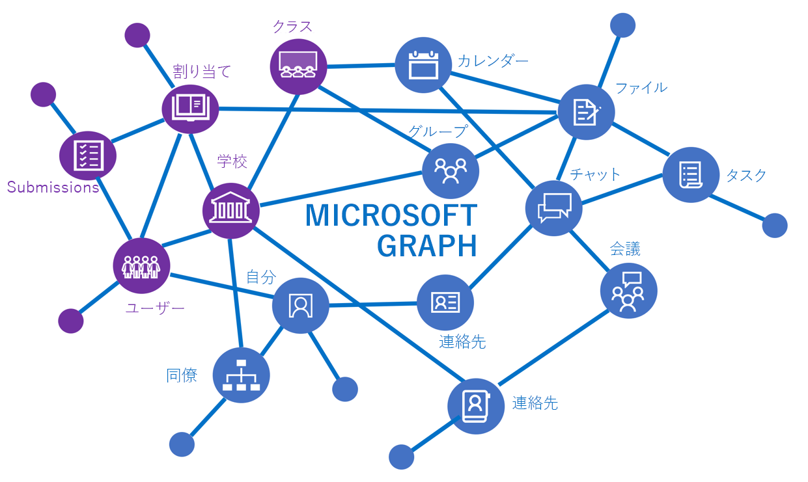
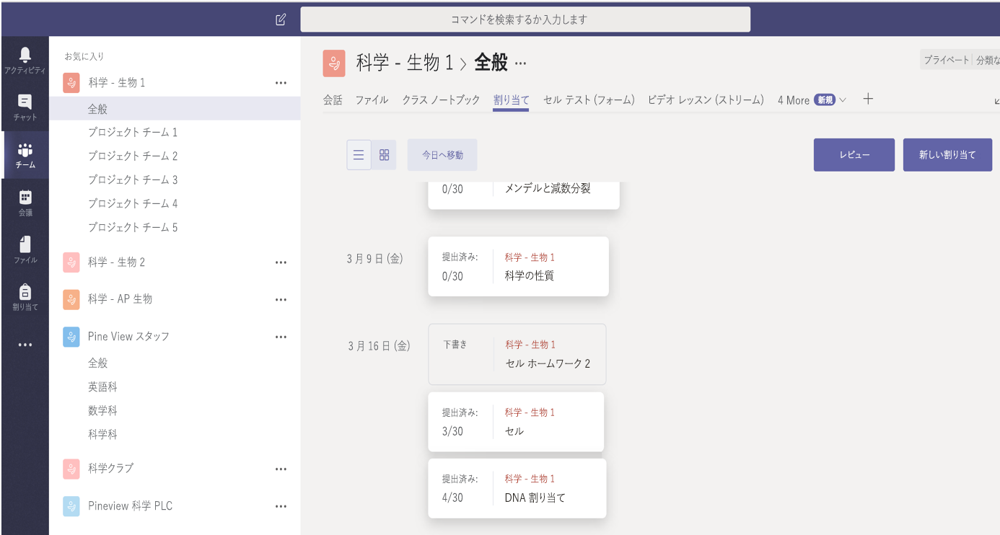

# 教育機関向け API の概要Education API overview

Microsoft Graph の教育機関向け API は、教育のさまざまなシナリオに関係する情報によって Office 365 のリソースを拡張します。それには、学校、クラス、ユーザー (学生と教師)、課題、および提出に関する情報が含まれます。The education API in Microsoft Graph enhances Office 365 resources with information that is relevant for education scenarios, including information about schools, classes, users (students and teachers), assignments, and submissions. これにより、学校やクラスルームのさまざまなシナリオのための教育関連リソースの統合ソリューションを容易に構築できます。This makes it easy for you to build solutions that integrate with educational resources for various school and classroom scenarios.

Microsoft Graph の教育機関向け API は、クラス、学校、ユーザー、課題、提出などの情報へのアクセスを提供します。The education API in Microsoft Graph provides access to classes, schools, users, assignments, submissions and more.

## 教育のシナリオを統合する理由Why integrate with education scenarios?

### クラスの名簿を認識するアプリケーションのビルドBuild applications that are aware of class roster

教育関連のソフトウェア開発者の多くは、クラス名簿がアプリケーション実行に必要な情報の重要な部分の 1 つであるが、多くの場合は学校の学生情報システム (SIS) の内部にしまい込まれているという事実に早い段階で気付いています。Most education software developers learn early on that class roster is one of the key pieces of information they need to run their application, and it's typically locked away inside a school Student Information System (SIS). 教師が新しいアプリケーションをクラスルームに導入しようとする場合、手動で名簿データをアプリケーションにインポートするために多くの時間を費やすことになります。Any time teachers bring a new application into their classroom, they spend time manually importing roster data into the app. 多くの ISV では、SIS に接続して名簿データをインポートすることによりこの問題に対処しています。Many ISVs address this by connecting with a SIS to import roster data. 何百とある学生情報システムで、それぞれ独自の書式が使用されているということが課題となります。With hundreds of Student Information Systems with proprietary formats, this can become a challenge. [Microsoft School Data Sync](https://sds.microsoft.com/) と名簿 API を組み合わせることにより、アプリケーション開発者と学校がこの課題に対処できます。[Microsoft School Data Sync](https://sds.microsoft.com/), combined with roster APIs, addresses this challenge for application developers and schools.

名簿 API で可能になるシナリオのいくつかを次に示します:The following are some of the scenarios that the roster APIs enable:

- [学校内の全クラスを取得するGet all classes in a school](https://developer.microsoft.com/en-us/graph/docs/api-reference/v1.0/api/educationschool_list_classes)
- [クラス内の全ユーザーを取得するGet all users in a class](https://developer.microsoft.com/en-us/graph/docs/api-reference/v1.0/api/educationclass_list_members)
- [教師の担当する全クラスを取得するGet all the classes I teach](https://developer.microsoft.com/en-us/graph/docs/api-reference/v1.0/api/educationuser_list_classes)

### Microsoft Teams を使用して割り当てタブでクラス割り当てを作成するUse Microsoft Teams to create class assignments in an assignments tab

割り当て API を使用することにより、クラス割り当てを管理する Web アプリを作成し、新しいカスタム タブ上でアプリを Microsoft Teams に統合することができます。You can use the assignments API to create a web app that manages class assignments and then integrate your app into Microsoft Teams on a new custom tab.  

Office 365 の Microsoft Teams は、会話、コンテンツ、およびアプリを、クラスルールのための 1 つの場所にまとめるデジタル ハブです。Microsoft Teams in Office 365 is a digital hub that brings conversations, content, and apps together in one place for classrooms. Microsoft Teams は、タブ、コネクタ、およびボットの作成など、[豊富な機能拡張ポイントのセット](https://docs.microsoft.com/en-us/microsoftteams/platform/concepts/apps/apps-overview)を提供します。Microsoft Teams provides a [rich set of extensibility points](https://docs.microsoft.com/en-us/microsoftteams/platform/concepts/apps/apps-overview), including creating Tabs, Connectors, and Bots. それらの機能拡張ポイントでは、Microsoft Graph の教育機関向け API を呼び出すことにより、課題や提出を処理することができます。These extensibility points can call education APIs in Microsoft Graph to work with assignments and submissions. 機能拡張ポイントを他の Microsoft Graph API や、課題と提出の API により有効にすることによって、さらに総合的なエクスペリエンスを構築します。Build a more comprehensive experience by enabling your extension point with any other Microsoft Graph API along with assignment and submission APIs.

教育機関向けに、教育機関のクラス (チーム) のコンテキストで Microsoft Teams カスタム タブが開かれており、作成や配布から、評価やフィードバックに至るまで、エンドツーエンドの割り当てフローを意味ある方法で管理できます。For education, Microsoft Teams custom tab apps are opened in an education class (a team) context, where it makes sense to manage the end-to-end assignment flow, from creation and distribution to grading and feedback. これは、Microsoft Teams で時間が節約され、日常的な作業が簡素化されることのほんの一例に過ぎません。この例の場合、教職員は雑務から解放されて学生に注意を集中できます。This is just one example of how Microsoft Teams saves time and simplifies everyday logistics, leaving educators free to dedicate themselves to their students.

次の図に、**理科 - 生物 1** のクラス用の課題カスタム タブで課題を管理するための Web アプリを示します。The following image shows a web app for managing assignments in an Assignments custom Tab for a **Science - Biology 1** class.

割り当て API により、Microsoft Teams 外でアプリが課題サービスと対話処理を実行できます。With the assignment API, your app can interact with the assignment service outside of Microsoft Teams. 配布、期限、評価は Microsoft Teams によって処理される一方、システムには、学生のための機能豊富な学習エクスペリエンスが用意されています。Microsoft Teams will handle distribution, due dates, and grading while your system can provide a rich learning experience to students.
割り当て API によって有効になるシナリオ例のいくつかを次に示します:The following are examples of a few scenarios enabled by the assignments API:

- [アプリケーションにリンクした課題を追加するAdd an assignment that links to your application](https://developer.microsoft.com/en-us/graph/docs/api-reference/beta/api/educationclass_post_assignments) 
- [アプリケーションにリンクした課題について個々の学生に評価を割り当てるAssign grades to individual students for assignments linked to your application](https://developer.microsoft.com/en-us/graph/docs/api-reference/beta/api/educationsubmission_update)
- [割り当てとその期限を示す学生ダッシュボードを作成するCreate a student dashboard to show which assignments are due by when](https://developer.microsoft.com/en-us/graph/docs/api-reference/beta/api/educationclass_list_assignments)

### 学校管理者が、学校データ同期管理 (プレビュー) を使用して ID および名簿の同期を管理できるようにするEnable school admins to manage identity and roster sync using School Data Sync Management (preview)

[学校データ同期](https://sds.microsoft.com/)は、Azure Active Directory (Azure AD) および Office 365 により、学生の ID と名簿データを学生情報システムからインポートし、同期するプロセスを自動化するのに役立ちます。[School Data Sync](https://sds.microsoft.com/) helps to automate the process of importing and synchronizing student identity and roster data from student information systems with Azure Active Directory (Azure AD) and Office 365. 情報が同期されると、名簿 API を使用することにより、名簿情報をアプリケーションに読み込むことができます。When the information is synchronized, you can use the roster APIs to read the roster information into the applications. 学校の学生情報システムと学校データ同期との統合処理を担当するシステム統合担当者は、Microsoft Graph で [SDS 管理 API](https://developer.microsoft.com/en-us/graph/docs/api-reference/beta/resources/educationsynchronizationprofile) を使用することにより、CSV ファイルまたはサポートされている SIS API コネクタのいずれかからの同期処理をセットアップすることができます。If you're a system integrator setting up integration of a school's Student Information System with School Data Sync, you can use the [SDS management APIs](https://developer.microsoft.com/en-us/graph/docs/api-reference/beta/resources/educationsynchronizationprofile) in Microsoft Graph to set up synchronization from either a CSV file or a supported SIS API connector.

学校データ同期管理 API では、同期管理のためのエンドツーエンドのシナリオがサポートされています。たとえば:School Data Sync management APIs support end-to-end scenarios for managing sync; for example:

- [自動的に同期を開始する同期ファイルを作成するCreate a synchronization profile that automatically starts a sync](https://developer.microsoft.com/en-us/graph/docs/api-reference/beta/api/educationsynchronizationprofile_post)
- [一時停止](https://developer.microsoft.com/en-us/graph/docs/api-reference/beta/api/educationsynchronizationprofile_pause)、[再開](https://developer.microsoft.com/en-us/graph/docs/api-reference/beta/api/educationsynchronizationprofile_resume)、および[リセット](https://developer.microsoft.com/en-us/graph/docs/api-reference/beta/api/educationsynchronizationprofile_reset)の操作により同期ライフサイクルを管理するManage sync lifecycle with [pause](https://developer.microsoft.com/en-us/graph/docs/api-reference/beta/api/educationsynchronizationprofile_pause), [resume](https://developer.microsoft.com/en-us/graph/docs/api-reference/beta/api/educationsynchronizationprofile_resume) and [reset](https://developer.microsoft.com/en-us/graph/docs/api-reference/beta/api/educationsynchronizationprofile_reset) operations

## 次の手順Next Steps

- 教育機関向け API を初めて使用する場合は、以下を参照してください:To start using the education APIs, see:
    - [名簿 API を使用するUse the roster APIs](https://developer.microsoft.com/en-us/graph/docs/api-reference/v1.0/resources/education-overview)
    - [割り当て API を使用するUse the assignment APIs](https://developer.microsoft.com/en-us/graph/docs/api-reference/beta/resources/educationassignment)
    - [SDS 管理 API を使用するUse the SDS management APIs](https://developer.microsoft.com/en-us/graph/docs/api-reference/beta/resources/educationsynchronizationprofile)
- [Graph Explorer](https://developer.microsoft.com/en-us/graph/graph-explorer) で教育機関向け API を試す。Try the education APIs in [Graph Explorer](https://developer.microsoft.com/en-us/graph/graph-explorer).
- 次の教育関連サンプルについて調べる:Explore the following education-related samples:
    - [SSO および名簿管理についての .NET サンプル.NET sample for SSO & Rostering](https://github.com/OfficeDev/O365-EDU-AspNetMVC-Samples)
    - [SSO および名簿管理についての Angular ノード サンプルAngular Node sample for SSO & Rostering](https://github.com/OfficeDev/O365-EDU-AngularNodeJS-Samples)   
    - [SSO および名簿管理についての Python サンプルPython sample for SSO & Rostering](https://github.com/OfficeDev/O365-EDU-Python-Samples)
    - [SSO および名簿管理についての PHP サンプルPHP sample for for SSO & Rostering](https://github.com/OfficeDev/O365-EDU-PHP-Samples)
    - [プロファイル管理 API のサンプルSample for profile management APIs](https://github.com/OfficeDev/O365-EDU-SDS-AspNetMVC-Samples) 

 

