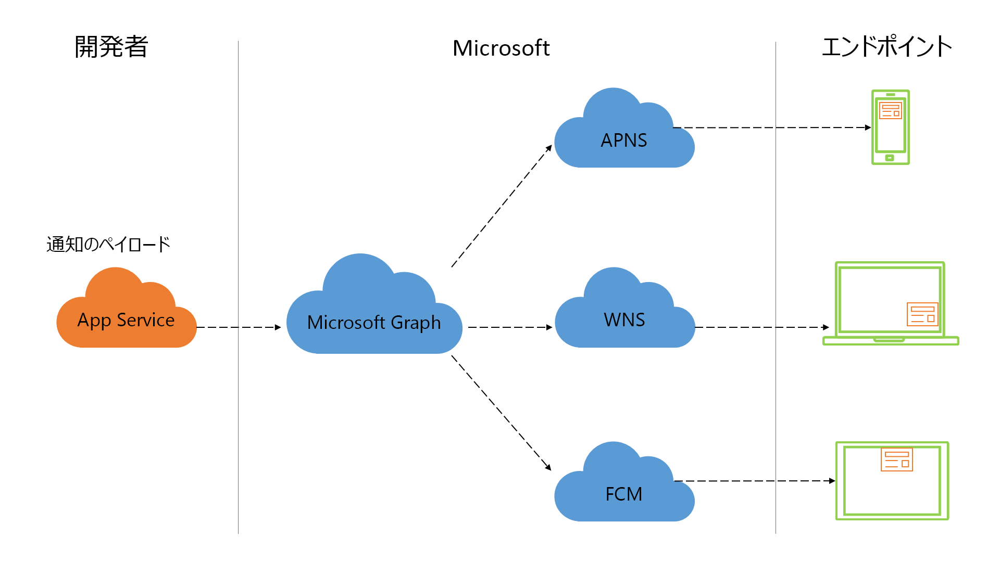

# Microsoft Graph 通知を使用して、人中心の通知エクスペリエンスを有効にするEnabling human-centric notification experiences using Microsoft Graph notifications

通知は、アプリケーション ユーザーと再びやり取りするのに最も効果的な方法の 1 つです。Notifications are one of the most effective and direct ways to communicate to and engage with your users. 優れた通知エクスペリエンスによってほぼリアルタイムにアプリケーション ユーザーとのコミュニケーション チャンネルを開くことができます。これにより、適切なタイミングでアプリケーションの使用が促進され、ユーザーの生産性が向上し、重要なイベントや必要なアクションが通知されます。A great notification experience can help open a near real-time communication channel between you and your users, and that in turn can increase app engagement at the right time, make users more productive, and alert them to important events or required actions.

> [!VIDEO https://www.youtube-nocookie.com/embed/cmpPFhrS8ZA]

今日、ユーザーはさまざまなプラットフォームやフォーム ファクターを経由してアプリケーションやサービスにアクセスできます。Today, users can access your applications and services via a wide variety of platforms and form factors. このようなデバイスの組み合わせでは、マルチプラットフォームの通知システムを理解してサポートし、ユーザーをエンドポイントにマッピングし、デバイス間で通知状態を維持する必要があります。This mix of devices requires that you understand and support multiplatform notification systems, map users to endpoints, and maintain notification state across devices. 

他のほとんどの通知システムでは、プラットフォーム固有のプッシュ通知システムを理解してターゲットにする必要はありませんが、それでも各デバイスをターゲットにするように設計されています。Most other notification systems eliminate the need to understand and target platform-specific push notification systems, but are still  designed to target each device. Microsoft Graph 通知は人中心のアプローチを提供します。これにより、あらゆるデバイス エンドポイントでユーザーをターゲットにすることができます。Microsoft Graph notifications provide a human-centric approach that gives you the ability to target your  users across any and all device endpoints.

## Microsoft Graph の通知機能を統合する理由Why integrate with Microsoft Graph notifications?

Microsoft Graph の通知は、アプリケーションに 4 つの主要な利点をもたらすユーザー中心の通知プラットフォームを提供します。Microsoft Graph notifications provide a user-centric notification platform that brings four key benefits to your applications.

### さまざまなエンドポイント間で通知配信ができるように、簡単にユーザーをターゲットとして設定するEffortlessly target your user for notification delivery across different endpoints

通知 API を使用して、個人の Microsoft アカウント、職場または学校の Azure Active Directory (Azure AD) アカウントをターゲットとして通知を配信できます。You can use the notifications API to target a personal Microsoft account or a work or school Azure Active Directory (Azure AD) account to deliver notifications. この通知はプラットフォームにより、Windows UWP、Android、iOS を含む、アプリケーションまたはサービスを実行しているすべてのユーザーのエンドポイントに配信されます。The platform distributes this notification to all user endpoints running your application or service, including Windows UWP, Android, and iOS. この機能は、適切な通知がどこにいても確実に到達できるようにすることで、アウトリーチを最大化します。This capability helps maximize outreach by ensuring appropriate notifications can reach your target, wherever they are.

### エンドポイント全体にわたって通知を簡単に管理するEasily manage notifications across endpoints

クライアント アプリケーションで [Microsoft Graph 通知クライアント SDK](https://github.com/microsoft/project-rome) を使用すると、通知の状態を更新し、更新後の状態をすべてのエンドポイントで同期できます。Using the [Microsoft Graph notifications client SDK](https://github.com/microsoft/project-rome) within your client application, you can update the state of a notification and sync that state across all endpoints. たとえば、ユーザーがあるデバイスで通知に対して操作 (開封済みまたは破棄済みとしてマークするなど) を行った場合、この状態変更が他のすべてのエンドポイントに伝播されます。For example, when a user acts on a notification on one device, you can update the state of this notification (such as marking it as read or dismissed), and the same state change will be distributed to all other endpoints. Microsoft Graph の通知 API は、一元管理された方法でユーザーの通知の状態を追跡します。したがって簡単かつ確実に、1 回処理された通知をすべての場所で非表示にできます。これにより、冗長性を最小限に抑え、優れたカスタマー エクスペリエンスを確保します。The Microsoft Graph notifications API tracks the state of your users' notifications in a centralized way, making it easy for you to ensure that your notifications are handled once, and dismissed everywhere.

### 通知状態と履歴を取得するRetrieve notification state and history

通知 API を使用して、ユーザー定義の期間 (最大 30 日間) に基づく通知履歴を取得できます。You can use the notifications API to retrieve notification history based on an expiration time you define (up to 30 days). 開封済みまたは破棄済みとしてマークされた通知でも、履歴から取得してアプリ内の通知履歴で表示でき、また分析情報とインテリジェンスを組み合わせることもできます。Notifications that are marked as read or dismissed are still retrievable from the history, enabling in-app views of notification history as well as enabling you to build on insights and intelligence.

### プライバシーとコンプライアンスPrivacy, security, and compliance in MyAnalytics

Microsoft Graph 通知は、ISO 27001、ISO 27018、EUMC、HIPAA、SOC 1、SOC 2、そして GDPR など、ほとんどの企業のコンプライアンス要件を満たします。Microsoft Graph notifications meet most enterprise compliance requirements, including ISO 27001, ISO 27018, EUMC, HIPAA, SOC 1, SOC 2, and of course GDPR.

## 開始するには?How do I get started?

はじめに、「[統合の概要](notifications-integration-e2e-overview.md)」セクションを参照し、アプリケーション内にユーザー中心の通知を統合する方法を確認してください。To get started, see the [integration overview](notifications-integration-e2e-overview.md) section to learn how you can integrate user-centric notifications within your application.
