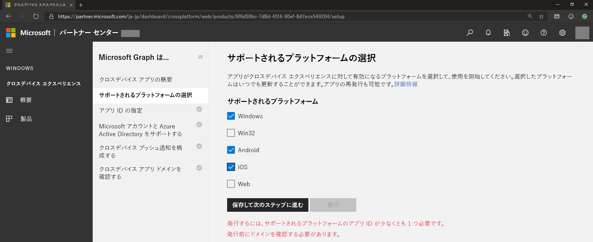
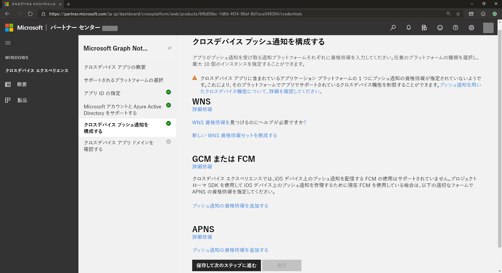
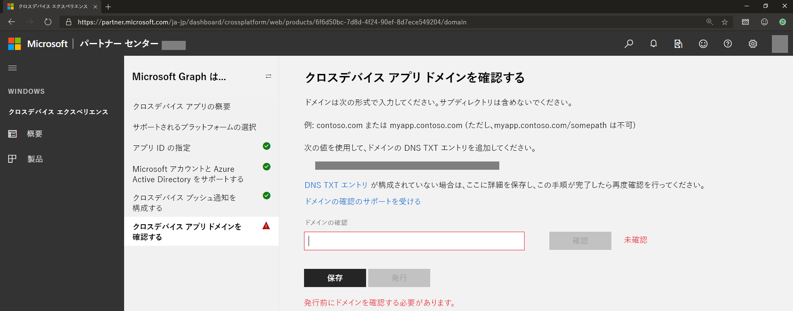

# Microsoft Graph notifications のクロスデバイス エクスペリエンス を開始する

[Azure ポータルでのアプリの登録](notifications-integration-app-registration.md)に加えて、各オペレーティングシステム (Windows、iOS、Android) に対応するネイティブプッシュ通知サービスを介して Microsoft Graph が通知を送信することを承認するために、アプリケーションにクロスプラットフォーム アプリケーション id やクロスプラットフォーム プッシュ通知認証情報などのクロスデバイス情報を登録する必要があります。 これは、[パートナー センターのダッシュボード (旧 Windows デベロッパー センター ダッシュボード) ](https://partner.microsoft.com/dashboard/)を通して行います。 

> [!NOTE]
> まだ Windows 開発者アカウントを持っていない場合は、アカウントを作成してください。 詳細については、[「開発者アカウントを開く」](https://docs.microsoft.com/ja-JP/windows/uwp/publish/opening-a-developer-account)を参照してください。 Windows UWP アプリケーションの構築を計画していない場合でも、この操作を行う必要があります。 学校または職場のアプリケーションをエンタープライズの一部として構築している場合は、エンタープライズ送信の管理に使用する適切な Azure AD アカウントと開発者アカウントを関連付けることができます。 詳細については、[「パートナーセンターアカウントに Azure Active Directory を関連付ける」](https://docs.microsoft.com/ja-JP/windows/uwp/publish/associate-azure-ad-with-partner-center)を参照してください。

まず、Windows 開発者アカウントを使用して[パートナーセンターのダッシュボード](https://partner.microsoft.com/en-us/dashboard)にサインインします (Azure AD アカウントを使用することはできません)。

1.  左のメニューで** [クロスデバイスエクスペリエンス]** に移動し、 **[新しいクロスデバイスアプリの構成]** を選択して、次のスクリーンショットのようにアプリ名を入力します。

2.  アプリのプレゼンスがあり、サポートされているすべてのプラットフォームを選択し、通知を受信できるようにします。 表示されているように、Windows、Android、iOS でサポートされているプラットフォームから選択できます。 

3.  表示されているように、アプリにプレゼンスがある場合は、それぞれのプラットフォームのアプリ ID を指定します。

 

> [!NOTE] 
> プラットフォームごとに異なる Id を10まで追加することができます。これは、同じアプリまたは異なるアプリの複数のバージョンがある場合に、アプリサーバーによって送信された同じユーザー宛の通知を受信できるようにするためです。

4.  Microsoft アカウント または Azure AD アプリの登録からアプリ ID を指定または選択します。 このクライアント ID は、Azure ポータルでの登録時に取得した Microsoft アカウント または Azure AD アプリの登録に対応しています。

5.  Microsoft Graph notifications は、すべての主要なプラットフォーム上で、それぞれのネイティブ通知プラットフォームを使用して、アプリケーションの クライアント エンドポイント、つまり WNS (Windows UWP 用)、FCM (Android 用)、および APNS (iOS) に通知を送信します。 次に示すように、ユーザー宛の通知を発行するときに Microsoft Graph notifications がアプリサーバーに通知を送信できるように、これらの通知プラットフォームに認証情報を指定します。

 

> [!NOTE]
> Windows UWP アプリの場合は、WNS プッシュ通知を有効にして Microsoft Graph notificationsを使用する必要があります。 詳しくは、[「 WNS の概要 」](https://docs.microsoft.com/ja-JP/windows/uwp/design/shell/tiles-and-notifications/windows-push-notification-services--wns--overview)をご覧ください。 開始後は、接続したデバイスプラットフォームにパートナーセンター経由でプッシュ認証情報を指定できます。

6.  このドメインの所有権がアプリケーションにあることを証明するための検証プロセスとして機能する クロスデバイス アプリドメイン を確認します。 これは、次に示すように、登録したアプリケーションのクロスデバイスアプリ id として動作します。
    
    

手順は以上です。 通知を受信するアプリケーションが登録されました。 次に、 [Microsoft Graph notifications SDK](https://github.com/microsoft/project-rome)をお使いのプラットフォームのプロジェクトに追加し、統合を開始します。 
