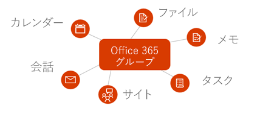

# Microsoft Graph での Office 365 グループの概要Overview of Office 365 groups in Microsoft Graph

Office 365 グループは、ユーザーが会話、ファイル、ノート、予定表、プラン、その他の多くのアセットを共有するための基本メンバーシップ サービスを提供します。Office 365 groups provide the foundational membership service for users to share conversations, files, notes, calendars, plans, and many other assets. 

## Office 365 グループを統合する理由Why integrate with Office 365 groups?   

グループは、さまざまなサービスを通じたユーザーのコラボレーションおよび統合を可能にし、タスクの計画、共同作業、教育、その他における豊富なシナリオをサポートするための基盤を形成します。Groups form the foundation that enables user collaboration and integration across services to support rich scenarios in task planning, teamwork, education, and more. Office 365 グループを統合することにより、何百万というユーザーが Office 365 スイートでのさまざまなエクスペリエンスやその他の間で移行するのをアプリケーションでサポートすることができます。When you integrate with Office 365 groups, your application can support millions of users as they transition across various experiences in the Office 365 suite and beyond.  
 
### さまざまなサービスの間の共同作業を容易にするためにグループを作成するCreate groups to facilitate teamwork across services 
 
Microsoft Graph API を使用することにより、コラボレーションのライフサイクルを通じてグループを作成、管理、または削除することができます。You can use the Microsoft Graph API to create, manage, or delete groups throughout the lifecycle of collaboration. たとえば次のことを実行できます。For example, you can specify the following:  
 
- [グループ作成](../api-reference/v1.0/api/group_post_groups.md) API を使用することにより、新しいグループを提供する。Use the [Create group](../api-reference/v1.0/api/group_post_groups.md) API to provision a new group. そのグループは、Outlook、SharePoint、Microsoft Teams、Planner、さらには Microsoft Stream など、一定の範囲のアプリケーションで利用できます。The group is then made available in a range of applications, such as Outlook, SharePoint, Microsoft Teams, Planner, and even Microsoft Stream. Microsoft Graph は、それら互いに接続されているサービスを通じて同期を保つことにより、グループの全メンバーに対してアクセスをシームレスに提供します。Microsoft Graph synchronizes across these connected services to seamlessly provide access to all group members.  
 
    **あらゆる Office 365 グループは、Office 365 のサービスの既定セットに統合されています****Every Office 365 group is integrated with a default set of Office 365 services**

      

- グループを自分の[お気に入り](../api-reference/v1.0/api/group_addfavorite.md)の 1 つとして指定したり、必要に応じて[自分のお気に入りから削除](../api-reference/v1.0/api/group_removefavorite.md)したりする。Enable members to indicate that a group is one of their [favorites](../api-reference/v1.0/api/group_addfavorite.md), or [remove it from their favorites](../api-reference/v1.0/api/group_removefavorite.md) if they choose. 
- カスタム アプリケーションでグループ会話を[作成](../api-reference/v1.0/api/group_post_conversations.md)、[取得](../api-reference/v1.0/api/group_get_conversation.md)、または[削除](../api-reference/v1.0/api/group_delete_conversation.md)する。[Create](../api-reference/v1.0/api/group_post_conversations.md), [get](../api-reference/v1.0/api/group_get_conversation.md), or [delete](../api-reference/v1.0/api/group_delete_conversation.md) group conversations from your custom application. 
- グループ予定表で予定表[イベント](../api-reference/v1.0/resources/event.md)をスケジューリングする。Schedule calendar [events](../api-reference/v1.0/resources/event.md) on the group calendar. 
- ドキュメント ライブラリの[リスト](../api-reference/v1.0/api/list_list.md)や[サブサイト](../api-reference/v1.0/api/site_list_subsites.md)など、グループに関連する [SharePoint サイト](../api-reference/v1.0/resources/site.md)についての情報を取得する。Get information about the [SharePoint site](../api-reference/v1.0/resources/site.md) that's associated with a group, such as the document library [lists](../api-reference/v1.0/api/list_list.md) or [subsites](../api-reference/v1.0/api/site_list_subsites.md). 
- Planner で、グループによって所有される[プランを作成](../api-reference/v1.0/api/planner_post_buckets.md)する。[Create a plan](../api-reference/v1.0/api/planner_post_buckets.md) in Planner that is owned by a group. プランは、[複数バケットを通じて整理](../api-reference/v1.0/api/planner_post_buckets.md)できる[タスクを作成](../api-reference/v1.0/api/planner_post_tasks.md)できるようにすることにより、共同作業を追跡するためのビジュアルな手段を提供します。The plan provides a visual way to track teamwork by allowing you to [create tasks](../api-reference/v1.0/api/planner_post_tasks.md) that can be [organized across buckets](../api-reference/v1.0/api/planner_post_buckets.md). 
- グループに関連する [OneNote](../api-reference/v1.0/resources/onenote.md) ノートブックにアクセスします。それは、会議のメモを収集し、アイデアを整理するために使用できます。Access the [OneNote](../api-reference/v1.0/resources/onenote.md) notebook associated with a group, which can be used for collecting meeting notes and organizing ideas. 
  
    **Web における Outlook での Office 365 のグループおよび会話****Office 365 groups and conversations in Outlook in the web**

     

- [Microsoft Teams でグループを有効にする](../api-reference/beta/api/team_put_teams.md) (プレビュー) ことにより、グループ メンバーが永続的チャットに参加できるようにする。[Enable a group for Microsoft Teams](../api-reference/beta/api/team_put_teams.md) (preview) to allow group members to engage in persistent chat.  
- [グループを削除するDelete groups](../api-reference/v1.0/api/group_delete.md) グループが削除されると、関連するすべてのコンテンツも削除されるため、サイト、会話、プランが孤立することはありません。When a group is deleted, all associated content is also deleted, which prevents orphaned sites, conversations, or plans. 
 
### グループ メンバーシップをシームレスに管理するManage group membership seamlessly 
 
Office 365 グループとは、Microsoft サービス内またはアプリ内のリソースへのアクセスを共有しているユーザーの集合です。Groups are collections of users and other principals who share access to resources in Microsoft services or in your app. グループ メンバーシップは一元的に集中管理されるため、メンバーシップに変更が加えられると、そのグループに関連するすべてのサービスに影響があります。Because group membership is managed centrally, any changes to membership affect all services associated with the group. Microsoft Graph を使用することにより、グループ メンバーシップに関する次のタスクを実行できます:You can use Microsoft Graph to perform the following group membership tasks:
 
- 既存のグループのメンバーを[追加](../api-reference/v1.0/api/group_post_members.md)したり[削除](../api-reference/v1.0/api/group_delete_members.md)したりする。[Add](../api-reference/v1.0/api/group_post_members.md) and [remove](../api-reference/v1.0/api/group_delete_members.md) members from an existing group. 
- グループの[所有者の一覧](../api-reference/v1.0/api/group_list_owners.md)または[メンバーの一覧](../api-reference/v1.0/api/group_list_members.md)を取得する。Get a [list of owners](../api-reference/v1.0/api/group_list_owners.md) or a [list of members](../api-reference/v1.0/api/group_list_members.md) for a group. これは、グループ コンテンツにアクセスできるユーザー、またはグループの更新や参加依頼の承認などの管理作業を実行することが必要になる可能性のあるユーザーと通信するのに役立ちます。This helps communicate who has access to group content, or who might need to perform administrative duties, such as renewing the group or approving a join request. 
- [グループ更新](../api-reference/v1.0/api/group_update.md)操作により、グループ コンテンツが同じ組織内のどのユーザーにも表示されるようにグループを**パブリック**として指定したり、グループ コンテンツがメンバーにのみ表示されるようにグループを**プライベート**として指定したりする。Designate groups as **Public**, where group content is visible to anyone in the same organization, or **Private**, where group content is only visible to members, via the [update group](../api-reference/v1.0/api/group_update.md) operation. 
- グループ所有者の一覧から、特定のグループの所有者責任に参加しなくなった[所有者を削除する](../api-reference/v1.0/api/group_delete_owners.md)。[Remove owners](../api-reference/v1.0/api/group_delete_owners.md) who are no longer participating in the ownership responsibilities for a particular group from the list of group owners. 
 
### グループ ポリシーの設定値を確立して維持するEstablish and maintain group policy settings 
 
1 つの組織内で作成されるグループの数が増えてきた場合、Microsoft Graph では、グループの使用状況やライフサイクルを管理するための機能がサポートされています。As the number of groups created within an organization begins to grow, Microsoft Graph supports the ability to govern the usage and lifecycle of the group. 組織内のすべてのグループを通じて、グループ ポリシーを適用することができます。You can enforce group policies across all groups within an organization. Microsoft Graph API を使用することにより、次のことを実行できます:You can use Microsoft Graph to:

- 幅広い範囲の[グループ ポリシー設定値](../api-reference/v1.0/resources/groupsetting.md)を構成する。これは、所有者によって更新されるのでない限りグループを自動削除したり、Office 365 グループに対して名前付けポリシーを適用したりするなどの動作を定義するのに役立ちます。Configure a broad range of [group policy settings](../api-reference/v1.0/resources/groupsetting.md) that help define behaviors, such as automatically deleting groups unless they are renewed by an owner and enforcing naming policies on Office 365 groups. 
- 期限切れの近いグループを[更新](../api-reference/v1.0/api/group_renew.md)することにより、チームのメンバーが、共同作業でコンテンツにアクセスし続けられるようにする。[Renew](../api-reference/v1.0/api/group_renew.md) groups that are about to expire to allow team members to continue with collaboration and accessing content. 確立されている期限切れポリシーに従ってグループが更新されない場合、そのグループは自動的に削除されます。If the group is not renewed according to the established expiration policy, the group is automatically deleted. 
- 削除されたグループを[復元する](../api-reference/v1.0/api/directory_deleteditems_restore.md)。[Restore](../api-reference/v1.0/api/directory_deleteditems_restore.md) deleted groups.
 
## 次の手順Next steps

- [Graph Explorer](https://developer.microsoft.com/ja-JP/graph/graph-explorer) で、サンプル API リクエストを試す。Try out some sample API requests in the [Graph Explorer](https://developer.microsoft.com/ja-JP/graph/graph-explorer). 
- Microsoft Graph で[グループ API を使用する](../api-reference/v1.0/resources/groups-overview.md)方法に関する詳細を確認する。Learn more about how to [use the groups API](../api-reference/v1.0/resources/groups-overview.md) in Microsoft Graph.
