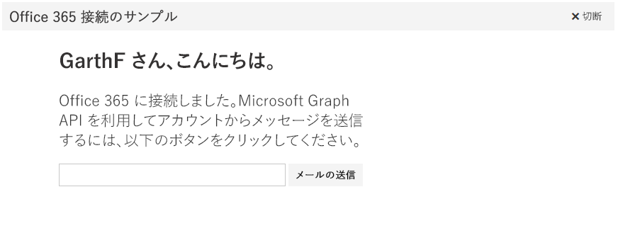

# <a name="get-started-with-microsoft-graph-in-a-python-app"></a>Python アプリで Microsoft Graph を使ってみる 

この記事では、Azure AD からアクセス トークンを取得し、Microsoft Graph を呼び出すために必要なタスクについて説明します。ここでは、[Python 用 Microsoft Graph Connect のサンプル](https://github.com/microsoftgraph/python3-connect-rest-sample)の手順と、Microsoft Graph API を使用するために実装する主要な概念について説明します。直接 REST 呼び出しを使用して Microsoft Graph にアクセスする方法について説明します。



##  <a name="prerequisites"></a>前提条件

* [Python 3.5.2](https://www.python.org/downloads/)
* [Flask-OAuthlib](https://github.com/lepture/flask-oauthlib)
* [Flask-Script 0.4](http://flask-script.readthedocs.io/en/latest/)
* [Microsoft アカウント](https://www.outlook.com/)または[ビジネス向けの Office 365 アカウント](https://msdn.microsoft.com/en-us/office/office365/howto/setup-development-environment#bk_Office365Account)
* [Python 用 Microsoft Graph Connect のサンプル](https://github.com/microsoftgraph/python3-connect-rest-sample)

## <a name="register-the-application-in-azure-active-directory"></a>Azure Active Directory にアプリケーションを登録する

最初に、アプリケーションを登録し、Microsoft Graph のサービスを使用するアクセス許可を設定する必要があります。これにより、ユーザーが職場または学校アカウントでアプリケーションにサインインできるようになります。

## <a name="register-the-application"></a>アプリケーションの登録

Microsoft アプリ登録ポータルでアプリを登録します。これにより、認証するアプリの構成に使用するアプリ ID とパスワードが生成されます。

1. 個人用アカウント、あるいは職場または学校アカウントのいずれかを使用して、[Microsoft アプリ登録ポータル](https://apps.dev.microsoft.com/)にサインインします。

2. **[アプリの追加]** を選択します。

3. アプリの名前を入力して、**[アプリケーションの作成]** を選択します。

    登録ページが表示され、アプリのプロパティが一覧表示されます。

4. アプリケーション ID をコピーします。これは、アプリの一意識別子です。

5. **[アプリケーション シークレット]** で、**[新しいパスワードを生成する]** を選択します。**[新しいパスワードが生成されました]** ダイアログからアプリ シークレットをコピーします。

    アプリを構成するには、アプリケーション ID とアプリ シークレットを使用します。

6. **[プラットフォーム]** で、**[プラットフォームの追加]** > **[Web]** の順に選択します。

7. **[暗黙的フローを許可する]** チェック ボックスが選ばれていることを確認して、リダイレクト URI として *http://localhost:5000/login/authorized* を入力します。

    **[暗黙的フローを許可する]** オプションにより、OpenID Connect ハイブリッド フローが有効になります。これにより、認証時にアプリはサインイン情報 (**id_token**) と成果物 (この場合は認証コード) の両方を受け取れるようになり、アプリはアクセス トークンを取得するときにこれらを使用できます。

    リダイレクト URI *http://localhost:5000/login/authorized* は、認証要求が処理されたときに OmniAuth ミドルウェアが使用するように構成される値です。

8. **[保存]** を選択します。

## <a name="configure-and-run-the-app"></a>アプリの構成と実行

1. 任意のテキスト エディターを使用して **_PRIVATE.txt** ファイルを開きます。
2. *ENTER_YOUR_CLIENT_ID* を登録済みのアプリケーションのクライアント ID と置き換えます。
3. *ENTER_YOUR_SECRET* を、アプリのために生成したキーと置き換えます。
4. ```python manage.py runserver``` を実行して開発サーバーを起動します。
5. Web ブラウザーで ```http://localhost:5000/``` に移動します。

<!--<a name="authCode"></a>-->
## <a name="receive-an-authorization-code-in-your-reply-url-page"></a>応答 URL ページで認証コードを受け取る

ユーザーがサインインすると、ブラウザーは返信 URL ([*connectsample.py*](https://github.com/microsoftgraph/python3-connect-rest-sample/blob/master/connectsample.py) の ```login/authorized``` ルーティング) にリダイレクトされます。応答にはアクセス トークンが含まれます。サンプルでは、トークンはセッション変数として格納されます。

```python
@app.route('/login/authorized')
def authorized():
    """Handler for login/authorized route."""
    response = msgraphapi.authorized_response()

    if response is None:
        return "Access Denied: Reason={0}\nError={1}".format( \
            request.args['error'], request.args['error_description'])

    # Check response for state
    if str(session['state']) != str(request.args['state']):
        raise Exception('State has been messed with, end authentication')
    session['state'] = '' # reset session state to prevent re-use

    # Okay to store this in a local variable, encrypt if it's going to client
    # machine or database. Treat as a password.
    session['microsoft_token'] = (response['access_token'], '')
    # Store the token in another session variable for easy access
    session['access_token'] = response['access_token']
    me_response = msgraphapi.get('me')
    me_data = json.loads(json.dumps(me_response.data))
    username = me_data['displayName']
    email_address = me_data['userPrincipalName']
    session['alias'] = username
    session['userEmailAddress'] = email_address
    return redirect('main')
```

<!--<a name="request"></a>-->
## <a name="use-the-access-token-in-a-request-to-the-microsoft-graph-api"></a>Microsoft Graph API への要求にアクセス トークンを使用する

アクセス トークンを使用することにより、あなたのアプリは Microsoft Graph API へ認証された要求を行うことができます。アプリで各要求の **Authorization** ヘッダーにアクセス トークンを追加する必要があります。

接続サンプルは、Microsoft Graph API で ```me/microsoft.graph.sendMail``` エンドポイントを使用してメールを送信します。コードは [*connectsample.py*](https://github.com/microsoftgraph/python3-connect-rest-sample/blob/master/connectsample.py) ファイル内の ```call_sendmail_endpoint``` 関数に記述されています。これは、Authorization ヘッダーにアクセス コードを付加する方法を示すコードです。

```python
    # Set request headers.
    headers = { 
      'User-Agent' : 'python_tutorial/1.0',
      'Authorization' : 'Bearer {0}'.format(access_token),
      'Accept' : 'application/json',
      'Content-Type' : 'application/json'
    }
```

> **注**: 要求は **Content-Type** ヘッダーに `application/json` など、Graph API に受け入れられる値も指定して送信します。

Microsoft Graph API は、あらゆる種類の Microsoft データとの対話に使用できる、非常に強力な統合 API です。API リファレンスを参照し、Microsoft Graph で何を行うことができるかを調べてください。

## <a name="see-also"></a>関連項目
- サンプルの REST 呼び出しを [API エクスプローラー](https://graph.microsoft.io/graph-explorer)で試す
- [Microsoft Graph を呼び出すためのトークンの取得](https://developer.microsoft.com/en-us/graph/docs/concepts/auth_overview)
- [ユーザーの代わりにアクセスを取得](https://developer.microsoft.com/en-us/graph/docs/concepts/auth_v2_user)
- [ユーザーなしでアクセスを取得](https://developer.microsoft.com/en-us/graph/docs/concepts/auth_v2_service)