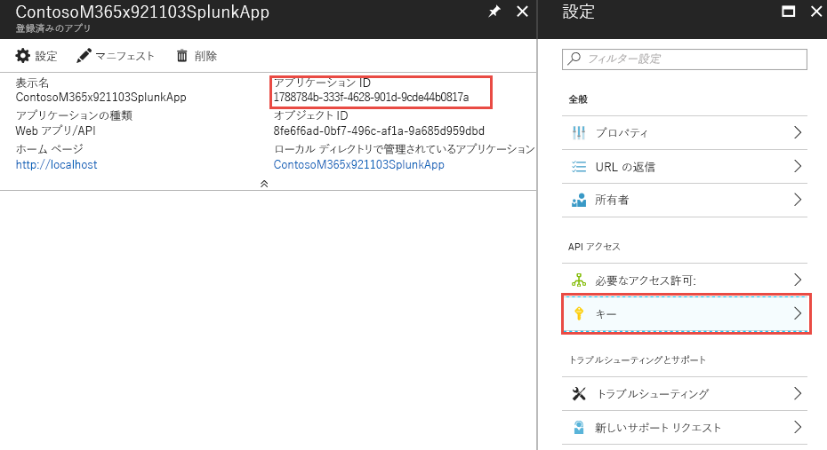
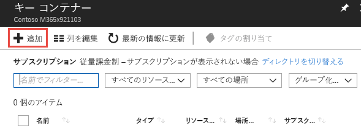
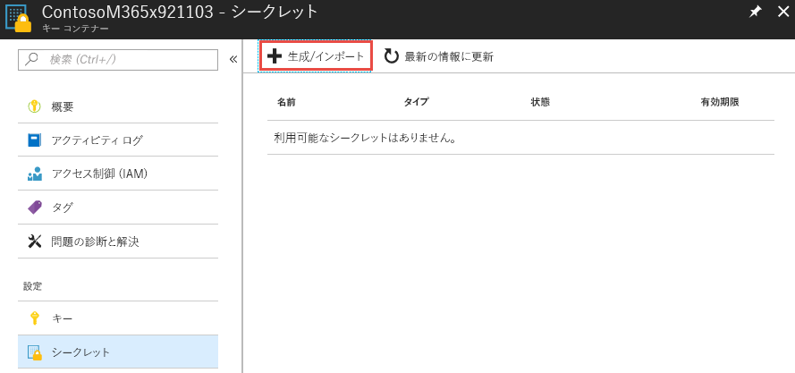

# <a name="integrate-microsoft-graph-security-api-alerts-with-your-siem-using-azure-monitor"></a><span data-ttu-id="d2b02-101">Azure Monitor を使った Microsoft Graph セキュリティ API の警告と SIEM の統合</span><span class="sxs-lookup"><span data-stu-id="d2b02-101">Integrate security API alerts with your SIEM using Azure Monitor</span></span>

<span data-ttu-id="d2b02-102">Microsoft Graph セキュリティのプロバイダーは、単一の REST エンドポイント経由で管理できます。</span><span class="sxs-lookup"><span data-stu-id="d2b02-102">The Microsoft Graph Security providers can be managed through a single REST endpoint.</span></span> <span data-ttu-id="d2b02-103">このエンドポイントは、[Azure Monitor](https://docs.microsoft.com/en-us/azure/monitoring-and-diagnostics/) に構成でき、いくつかの SIEM 製品へのコネクタをサポートしています。</span><span class="sxs-lookup"><span data-stu-id="d2b02-103">This endpoint can be configured to [Azure Monitor](https://docs.microsoft.com/en-us/azure/monitoring-and-diagnostics/) which supports connectors to several SIEM products.</span></span> <span data-ttu-id="d2b02-104">この記事の手順 1 と 2 の指示は、イベントハブ経由での消費をサポートするすべての Azure Monitor のコネクタに言及しています。</span><span class="sxs-lookup"><span data-stu-id="d2b02-104">The instructions in Steps 1 and 2 of this article refer to all Azure Monitor connectors that support consumption via event hubs.</span></span> <span data-ttu-id="d2b02-105">この記事では、[ Splunk](https://splunkbase.splunk.com/)SIEMコネクタのエンドツーエンドの統合について説明します。</span><span class="sxs-lookup"><span data-stu-id="d2b02-105">This article describes the end-to-end configuration for the Splunk SIEM connector.</span></span>

<span data-ttu-id="d2b02-106">この統合プロセスは、以下の手順から構成されます。</span><span class="sxs-lookup"><span data-stu-id="d2b02-106">The integration process involves the following steps:</span></span>

1. [<span data-ttu-id="d2b02-107">テナントのセキュリティの警告を受信するように Azure とイベント ハブをセットアップする</span><span class="sxs-lookup"><span data-stu-id="d2b02-107">Set up Azure your event hub to receive security alerts for your tenant</span></span>](#step-1-set-up-an-event-hubs-namespace-in-azure-to-receive-security-alerts-for-your-tenant)
2. [<span data-ttu-id="d2b02-108">テナントからイベント ハブにセキュリティの警告を送信するように Azure Monitor を構成する</span><span class="sxs-lookup"><span data-stu-id="d2b02-108">Configure Azure Monitor to send security alerts from your tenant to the event hub</span></span>](#step-2-configure-azure-monitor-to-send-security-alerts-from-your-tenant-to-the-event-hub)
3. [<span data-ttu-id="d2b02-109">Splunk がセキュリティの警告を使用できるように Splunk 向けの Azure Monitor アドオンをダウンロードしてインストールする</span><span class="sxs-lookup"><span data-stu-id="d2b02-109">Download and install the Azure Monitor Add-on for Splunk which will allow Splunk to consume security alerts</span></span>](#step-3-download-and-install-the-azure-monitor-add-on-for-splunk-which-will-allow-splunk-to-consume-security-alerts)
4. [<span data-ttu-id="d2b02-110">Splunk がイベント ハブからの読み取りに使用するアプリケーションをテナントの Azure Active Directory に登録する</span><span class="sxs-lookup"><span data-stu-id="d2b02-110">Register an application with your tenant Azure Active Directory which Splunk will use to read from the event hub</span></span>](#step-4-register-an-application-with-your-tenant-azure-active-directory-which-splunk-will-use-to-read-from-the-event-hub )
5. [<span data-ttu-id="d2b02-111">イベント ハブのアクセス キーを格納する Azure Key Vault を作成する</span><span class="sxs-lookup"><span data-stu-id="d2b02-111">Create an Azure Key vault to store the access key for the event hub</span></span>](#step-5-create-an-azure-key-vault-to-store-the-access-key-for-the-event-hub)
6. [<span data-ttu-id="d2b02-112">イベント ハブに格納されているセキュリティの警告を使用するように Splunk のデータ入力を構成する</span><span class="sxs-lookup"><span data-stu-id="d2b02-112">Configure the Splunk data inputs to consume security alerts stored in the event hub</span></span>](#step-6-configure-the-splunk-data-inputs-to-consume-security-alerts-stored-in-the-event-hub)

<span data-ttu-id="d2b02-113">上記の手順を完了すると、Splunk Enterprise はテナントにライセンスされたすべての Microsoft Graph 統合セキュリティ製品から出力されるセキュリティの警告を使用します。</span><span class="sxs-lookup"><span data-stu-id="d2b02-113">After you complete these steps, your Splunk Enterprise will consume security alerts from all the Microsoft Graph integrated security products for which your tenant is licensed.</span></span> <span data-ttu-id="d2b02-114">ユーザーがライセンスを取得した新しいセキュリティ製品もこの接続を使用して同じスキーマで警告を送信するため、追加の統合作業は発生しません。</span><span class="sxs-lookup"><span data-stu-id="d2b02-114">Any new security products that you license will also send alerts through this connection, in the same schema with no further integration work needed.</span></span>

## <a name="step-1-set-up-an-event-hubs-namespace-in-azure-to-receive-security-alerts-for-your-tenant"></a><span data-ttu-id="d2b02-115">手順 1: テナントのセキュリティの警告を受信するように Azure の Event Hubs 名前空間をセットアップする</span><span class="sxs-lookup"><span data-stu-id="d2b02-115">Step 1: Set up an Event Hubs namespace in Azure to receive security alerts for your tenant</span></span>

<span data-ttu-id="d2b02-116">はじめに、[Microsoft Azure Event Hubs](https://docs.microsoft.com/en-us/azure/event-hubs/) の名前空間とイベント ハブを作成する必要があります。</span><span class="sxs-lookup"><span data-stu-id="d2b02-116">To begin, you need to create a Microsoft Azure Event Hubs namespace and event hub.</span></span> <span data-ttu-id="d2b02-117">この名前空間とイベント ハブは、組織のすべてのセキュリティの警告の送信先になります。</span><span class="sxs-lookup"><span data-stu-id="d2b02-117">This namespace and event hub is the destination for all your organization’s security alerts.</span></span> <span data-ttu-id="d2b02-118">Event Hubs 名前空間は、同じアクセス ポリシーを共有するイベント ハブの論理的なグループです。</span><span class="sxs-lookup"><span data-stu-id="d2b02-118">An Event Hubs namespace is a logical grouping of event hubs that share the same access policy.</span></span> <span data-ttu-id="d2b02-119">Event Hubs 名前空間とイベント ハブを作成するときは、以下の点に注意してください。</span><span class="sxs-lookup"><span data-stu-id="d2b02-119">Note a few details about the Event Hubs namespace and event hubs that you create:</span></span>

- <span data-ttu-id="d2b02-120">特に同じイベント ハブを介して他の Azure 監視データを送信する場合は、Standard Event Hubs 名前空間を使用することをお勧めします。</span><span class="sxs-lookup"><span data-stu-id="d2b02-120">We recommend using a Standard Event Hubs namespace, particularly if you are sending other Azure monitoring data through these same event hubs.</span></span>
- <span data-ttu-id="d2b02-121">通常、必要なスループット ユニットは 1 つだけです。</span><span class="sxs-lookup"><span data-stu-id="d2b02-121">Typically, only one throughput unit is necessary.</span></span> <span data-ttu-id="d2b02-122">使用量の増加に合わせてスケールアップする必要がある場合は、名前空間のスループット ユニットの数を後からいつでも手動で増やすことができ、自動インフレを有効にすることもできます。</span><span class="sxs-lookup"><span data-stu-id="d2b02-122">If you need to scale up as your usage increases, you can always manually increase the number of throughput units for the namespace later or enable auto inflation.</span></span>
- <span data-ttu-id="d2b02-123">スループット ユニットの数によって、イベント ハブのスループットを増やすことができます。</span><span class="sxs-lookup"><span data-stu-id="d2b02-123">The number of throughput units allows you to increase throughput scale for your event hubs.</span></span> <span data-ttu-id="d2b02-124">パーティションの数によって、多くのコンシューマー間で使用量を並列化できます。</span><span class="sxs-lookup"><span data-stu-id="d2b02-124">The number of partitions allows you to parallelize consumption across many consumers.</span></span> <span data-ttu-id="d2b02-125">1 つのパーティションで最大 20 MBps (1 秒あたり約 20,000 メッセージ) に対応します。</span><span class="sxs-lookup"><span data-stu-id="d2b02-125">A single partition can do up to 20MBps, or approximately 20,000 messages per second.</span></span> <span data-ttu-id="d2b02-126">データを使用するツールによっては、複数のパーティションからの使用がサポートされない場合があります。</span><span class="sxs-lookup"><span data-stu-id="d2b02-126">Depending on the tool consuming the data, it may or may not support consuming from multiple partitions.</span></span> <span data-ttu-id="d2b02-127">設定するパーティションの数がわからない場合は、4 個のパーティションから始めることをお勧めします。</span><span class="sxs-lookup"><span data-stu-id="d2b02-127">If you're not sure about the number of partitions to set, we recommend starting with four partitions.</span></span>
- <span data-ttu-id="d2b02-128">イベント ハブでのメッセージのリテンション期間は、7 日間に設定することをお勧めします。</span><span class="sxs-lookup"><span data-stu-id="d2b02-128">We recommend that you set message retention on your event hub to 7 days.</span></span> <span data-ttu-id="d2b02-129">これにより、コンシューマー ツールの停止期間が 1 日を超えた場合でも、中断した時点 (最大 7 日前のイベントまで) をツールで選択できるようになります。</span><span class="sxs-lookup"><span data-stu-id="d2b02-129">If your consuming tool goes down for more than a day, this ensures that the tool can pick up where it left off (for events up to 7 days old).</span></span>
- <span data-ttu-id="d2b02-130">イベント ハブの既定のコンシューマー グループを使用することをお勧めします。</span><span class="sxs-lookup"><span data-stu-id="d2b02-130">We recommend using the default consumer group for your event hub.</span></span> <span data-ttu-id="d2b02-131">2 つの異なるツールが同じイベント ハブの同じデータを使用しない限り、追加のコンシューマー グループを作成したり、別のコンシューマー グループを使用したりする必要はありません。</span><span class="sxs-lookup"><span data-stu-id="d2b02-131">You don't need to create other consumer groups or use a separate consumer group unless you plan to have two different tools consume the same data from the same event hub.</span></span>
- <span data-ttu-id="d2b02-132">通常、イベント ハブのデータを使用するマシンのポート 5671 と 5672 を開く必要があります。</span><span class="sxs-lookup"><span data-stu-id="d2b02-132">Typically, port 5671 and 5672 must be opened on the machine consuming data from the event hub.</span></span>

<span data-ttu-id="d2b02-133">[Event Hubs のよく寄せられる質問](https://docs.microsoft.com/en-us/azure/event-hubs/event-hubs-faq)も参照してください。</span><span class="sxs-lookup"><span data-stu-id="d2b02-133">Also see the [Azure Event Hubs FAQ](https://docs.microsoft.com/en-us/azure/event-hubs/event-hubs-faq).</span></span>

1. <span data-ttu-id="d2b02-134">[Azure Portal](https://portal.azure.com/) にログオンし、画面左上の **[リソースの作成]** を選択します。</span><span class="sxs-lookup"><span data-stu-id="d2b02-134">Log on to the [Azure portal](https://portal.azure.com/) and choose **Create a resource** at the top left of the screen.</span></span>

    ![[リソースの作成] の画像](../concepts/images/create-resource.png)

2. <span data-ttu-id="d2b02-136">**[モノのインターネット (IoT)]** を選択し、**[Event Hubs]** を選択します。</span><span class="sxs-lookup"><span data-stu-id="d2b02-136">Select **Internet of Things** and choose **Event Hubs**.</span></span>

    ![[Event Hubs] の画像](../concepts/images/event-hubs.png)

3. <span data-ttu-id="d2b02-138">**[名前空間の作成]** で、名前空間の名前を入力します。</span><span class="sxs-lookup"><span data-stu-id="d2b02-138">In **Create namespace**, enter a namespace name.</span></span> <span data-ttu-id="d2b02-139">名前空間の名前が使用できることを確認した後、価格レベル (Basic または Standard) を選択します。</span><span class="sxs-lookup"><span data-stu-id="d2b02-139">After making sure the namespace name is available, choose the pricing tier (Basic or Standard).</span></span> <span data-ttu-id="d2b02-140">さらに、Azure サブスクリプション、リソース グループ、およびリソースを作成する場所を選択します。</span><span class="sxs-lookup"><span data-stu-id="d2b02-140">Also, choose an Azure subscription, resource group, and location in which to create the resource.</span></span> <span data-ttu-id="d2b02-141">**[作成]** を選択して名前空間を作成します。</span><span class="sxs-lookup"><span data-stu-id="d2b02-141">Choose **Create** to create the namespace.</span></span> <span data-ttu-id="d2b02-142">システムによるリソースのプロビジョニングが完了するまで、数分かかることがあります。</span><span class="sxs-lookup"><span data-stu-id="d2b02-142">You might have to wait a few minutes for the system to fully provision the resources.</span></span>

    ![[名前空間の作成] の画像](../concepts/images/create-namespace.png)

## <a name="step-2-configure-azure-monitor-to-send-security-alerts-from-your-tenant-to-the-event-hub"></a><span data-ttu-id="d2b02-144">手順 2: テナントからイベント ハブにセキュリティの警告を送信するように Azure Monitor を構成する</span><span class="sxs-lookup"><span data-stu-id="d2b02-144">Step 2: Configure Azure Monitor to send security alerts from your tenant to the event hub</span></span>

<span data-ttu-id="d2b02-145">Azure Monitor を使った組織のセキュリティの警告のストリーミングを有効にする操作は、Azure Active Directory (Azure AD) テナント全体で 1 回だけ実行します。</span><span class="sxs-lookup"><span data-stu-id="d2b02-145">Enabling the streaming of your organization’s security alerts through Azure Monitor is done one time for your entire Azure Active Directory (Azure AD) tenant.</span></span> <span data-ttu-id="d2b02-146">Microsoft Graph セキュリティ API がライセンスされ有効になっているすべての製品では、実行しているアプリケーションにデータをストリーミングしながら、Azure Monitor にセキュリティ警告を送信し始めます。</span><span class="sxs-lookup"><span data-stu-id="d2b02-146">All security API licensed and enabled products will begin sending security alerts to Azure Monitor, streaming data to consuming applications.</span></span> <span data-ttu-id="d2b02-147">所属組織がライセンスし展開した Microsoft Graph セキュリティ API が有効になっている追加の製品はすべて、この同じ Azure Monitor の構成を経由して、セキュリティ警告を自動的にストリーミングします。</span><span class="sxs-lookup"><span data-stu-id="d2b02-147">Any additional security API-enabled products licensed and deployed by your organization will automatically stream security alerts through this same Azure Monitor configuration.</span></span> <span data-ttu-id="d2b02-148">組織内で追加の統合作業は発生しません。</span><span class="sxs-lookup"><span data-stu-id="d2b02-148">No further integration work is needed from the organization.</span></span>

<span data-ttu-id="d2b02-149">セキュリティの警告は、通常は組織内のセキュリティ対応担当者と全体管理者だけが表示できる高い権限を持つデータです。</span><span class="sxs-lookup"><span data-stu-id="d2b02-149">Security alerts are highly privileged data typically viewable only by security response personnel and global administrators within an organization.</span></span> <span data-ttu-id="d2b02-150">このため、テナントのセキュリティの警告と SIEM システムの統合を構成する手順では、Azure AD の全体管理者アカウントが必要です。</span><span class="sxs-lookup"><span data-stu-id="d2b02-150">For this reason, the steps required to configure the integration of a tenant’s security alerts with SIEM systems require an Azure AD Global Administrator account.</span></span> <span data-ttu-id="d2b02-151">このアカウントは、セットアップ中に組織のセキュリティの警告を Azure Monitor に送信するように要求するときに 1 回だけ使用されます。</span><span class="sxs-lookup"><span data-stu-id="d2b02-151">This account is only needed one time, during setup, to request your organization’s security alerts be sent to Azure Monitor.</span></span>

> <span data-ttu-id="d2b02-152">**注:** 現時点では、Azure Monitor の [診断設定] ブレードでは、テナント レベルのリソースの構成をサポートしていません。</span><span class="sxs-lookup"><span data-stu-id="d2b02-152">**Note:** At this time, the Azure Monitor Diagnostic settings blade does not allow configuration of tenant-level resources.</span></span> <span data-ttu-id="d2b02-153">Microsoft Graph セキュリティ API の警告はテナント レベルのリソースで、Azure のリソース マネージャーの API を使用して、組織のセキュリティの警告の消費をサポートするように、Azure Monitor を構成する必要があります。</span><span class="sxs-lookup"><span data-stu-id="d2b02-153">Microsoft Graph Security API alerts are a tenant-level resource, which requires using the Azure Resource Manager API to configure Azure Monitor to support consumption of your organization’s security alerts.</span></span>

1. <span data-ttu-id="d2b02-154">Azure サブスクリプションで "microsoft.insights" (Azure Monitor) をリソース プロバイダーとして登録します。</span><span class="sxs-lookup"><span data-stu-id="d2b02-154">In your Azure subscription, register "microsoft.insights" (Azure Monitor) as a resource provider.</span></span>  
> <span data-ttu-id="d2b02-155">**注:** "Microsoft.SecurityGraph" (Microsoft Graph のセキュリティ API) は、前述のようにテナント レベルのリソースですので、Azure サブスクリプションのリソース プロバイダーとしては登録しないでください。</span><span class="sxs-lookup"><span data-stu-id="d2b02-155">**Note:** Do not register "Microsoft.SecurityGraph" (Microsoft Graph Security API) as a resource provider in your Azure subscription, as “Microsoft.SecurityGraph” is a tenant-level resource as explained above.</span></span> <span data-ttu-id="d2b02-156">テナント レベル構成は後述する #6 で扱います。</span><span class="sxs-lookup"><span data-stu-id="d2b02-156">Tenant level configuration will be part of #6 below.</span></span>

2. <span data-ttu-id="d2b02-157">Azure Resource Manager API を使用して Azure Monitor を構成するには、[ARMClient](https://github.com/projectkudu/ARMClient) ツールを入手します。</span><span class="sxs-lookup"><span data-stu-id="d2b02-157">To configure Azure Monitor using the Azure Resource Manager API, obtain the [ARMClient](https://github.com/projectkudu/ARMClient) tool.</span></span> <span data-ttu-id="d2b02-158">このツールは、コマンド ラインから Azure Portal に REST API 呼び出しを送信するために使用されます。</span><span class="sxs-lookup"><span data-stu-id="d2b02-158">This tool will be used to send REST API calls to the Azure portal from a command line.</span></span>

3. <span data-ttu-id="d2b02-159">次のような診断設定要求の JSON ファイルを準備します。</span><span class="sxs-lookup"><span data-stu-id="d2b02-159">Prepare a diagnostic setting request JSON file like the following:</span></span>

    ``` json
    {
      "location": "",
      "properties": {
        "name": "securityApiAlerts",
        "serviceBusRuleId": "/subscriptions/SUBSCRIPTION_ID/resourceGroups/RESOURCE_GROUP/providers/Microsoft.EventHub/namespaces/EVENT_HUB_NAMESPACE/authorizationrules/RootManageSharedAccessKey",
        "logs": [
          {
            "category": "Alert",
            "enabled": true,
            "retentionPolicy": {
              "enabled": true,
              "days": 7
            }
          }
        ]
      }
    }
    ```

    <span data-ttu-id="d2b02-160">JSON ファイル内の値を次のように置き換えます。</span><span class="sxs-lookup"><span data-stu-id="d2b02-160">Replace the values in the JSON file as follows:</span></span>

    <span data-ttu-id="d2b02-161">**SUBSCRIPTION_ID** は、組織からセキュリティの警告を送信するときに使用するリソース グループとイベント ハブの名前空間をホストする Azure サブスクリプションのサブスクリプション ID です。</span><span class="sxs-lookup"><span data-stu-id="d2b02-161">**SUBSCRIPTION_ID** is the Subscription ID of the Azure subscription hosting the resource group and event hub namespace where you will be sending security alerts from your organization.</span></span>

    <span data-ttu-id="d2b02-162">**RESOURCE_GROUP** は、組織からセキュリティの警告を送信するときに使用するイベント ハブの名前空間を含むリソース グループです。</span><span class="sxs-lookup"><span data-stu-id="d2b02-162">**RESOURCE_GROUP** is the resource group containing the event hub namespace where you will be sending security alerts from your organization.</span></span>

    <span data-ttu-id="d2b02-163">**EVENT_HUB_NAMESPACE** は、組織からセキュリティの警告を送信するときに使用するイベント ハブの名前空間です。</span><span class="sxs-lookup"><span data-stu-id="d2b02-163">**EVENT_HUB_NAMESPACE** is the event hub namespace where you will be sending security alerts from your organization.</span></span>

    <span data-ttu-id="d2b02-164">**“days”:** は、イベント ハブにメッセージを保持する日数です。</span><span class="sxs-lookup"><span data-stu-id="d2b02-164">**“days”:** 7 is the number of days you want to retain messages in your event hub.</span></span>

4. <span data-ttu-id="d2b02-165">ARMClient.exe を起動するディレクトリに、このファイルを JSON 形式で保存します。</span><span class="sxs-lookup"><span data-stu-id="d2b02-165">Save the file as JSON to the directory where you will invoke ARMClient.exe.</span></span> <span data-ttu-id="d2b02-166">たとえば、ファイル名を **AzMonConfig.json** とします。</span><span class="sxs-lookup"><span data-stu-id="d2b02-166">For example, name the file **AzMonConfig.json.**</span></span>

5. <span data-ttu-id="d2b02-167">次のコマンドを実行して ARMClient ツールにサインインします。</span><span class="sxs-lookup"><span data-stu-id="d2b02-167">Run the following command to sigh in to the ARMClient tool.</span></span> <span data-ttu-id="d2b02-168">全体管理者アカウントの資格情報を使用する必要があります。</span><span class="sxs-lookup"><span data-stu-id="d2b02-168">You will need to be using Global Administrator account credentials.</span></span>

    ``` shell
    ARMClient.exe login
    ```

6. <span data-ttu-id="d2b02-169">次のコマンドを実行して、セキュリティの警告をイベント ハブの名前空間に送信するように Azure Monitor を構成します。</span><span class="sxs-lookup"><span data-stu-id="d2b02-169">Run the following command to configure Azure Monitor to send security alerts to your event hub namespace.</span></span> <span data-ttu-id="d2b02-170">これにより、名前空間の内部にイベント ハブが自動的にプロビジョニングされ、セキュリティの警告のイベント ハブへのフローが開始されます。</span><span class="sxs-lookup"><span data-stu-id="d2b02-170">This will automatically provision an event hub within the namespace and start the flow of security alerts into the event hub.</span></span> <span data-ttu-id="d2b02-171">設定名 (この例では **securityApiAlerts**) が JSON ファイルの **name** フィールドに設定した設定名と一致することを確認してください。</span><span class="sxs-lookup"><span data-stu-id="d2b02-171">Ensure that the setting name (in this example, **securityApiAlerts**) matches the setting name you specified in the JSON file for the **name** field.</span></span>

    ``` shell
    ARMClient.exe put https://management.azure.com/providers/Microsoft.SecurityGraph/diagnosticSettings/securityApiAlerts?api-version=2017-04-01-preview  @".\AzMonConfig.json"
    ```

7. <span data-ttu-id="d2b02-172">設定が正しく適用されていることを確認するには、次のコマンドを実行して、出力が JSON ファイルの設定と一致していることを確認します。</span><span class="sxs-lookup"><span data-stu-id="d2b02-172">To verify the settings were applied correctly, run this command and verify that the output matches your JSON file settings.</span></span>

    ``` shell
    ARMClient.exe get https://management.azure.com/providers/Microsoft.SecurityGraph/diagnosticSettings/securityApiAlerts?api-version=2017-04-01-preview
    ```
8. <span data-ttu-id="d2b02-173">ARMClient ツールを終了します。</span><span class="sxs-lookup"><span data-stu-id="d2b02-173">Exit the ARMClient tool.</span></span> <span data-ttu-id="d2b02-174">これで、イベント ハブにテナントのセキュリティの警告を送信するための Azure Monitor の構成が完了しました。</span><span class="sxs-lookup"><span data-stu-id="d2b02-174">You have now completed the configuration of Azure Monitor to send security alerts from your tenant to event hub.</span></span>

## <a name="step-3-download-and-install-the-azure-monitor-add-on-for-splunk-which-will-allow-splunk-to-consume-security-alerts"></a><span data-ttu-id="d2b02-175">手順 3: Splunk がセキュリティの警告を使用できるように Splunk 向けの Azure Monitor アドオンをダウンロードしてインストールする</span><span class="sxs-lookup"><span data-stu-id="d2b02-175">Step 3: Download and install the Azure Monitor Add-on for Splunk which will allow Splunk to consume security alerts</span></span>

1. <span data-ttu-id="d2b02-176">この統合は、[ Splunk](https://splunkbase.splunk.com/)   のエンタープライズ環境をサポートするだけです。</span><span class="sxs-lookup"><span data-stu-id="d2b02-176">This integration only supports Splunk Enterprise deployments.</span></span>
2. <span data-ttu-id="d2b02-177">[Splunk 向けの Azure Monitor アドオン](https://github.com/Microsoft/AzureMonitorAddonForSplunk)をダウンロードしてインストールします。</span><span class="sxs-lookup"><span data-stu-id="d2b02-177">Download and install the [Azure Monitor Add-on for Splunk](https://github.com/Microsoft/AzureMonitorAddonForSplunk).</span></span> <span data-ttu-id="d2b02-178">インストール手順の詳細については、[インストール](https://github.com/Microsoft/AzureMonitorAddonForSplunk/wiki/Installation)を参照してください。</span><span class="sxs-lookup"><span data-stu-id="d2b02-178">For detailed installation instructions, see [Installation](https://github.com/Microsoft/AzureMonitorAddonForSplunk/wiki/Installation).</span></span> <span data-ttu-id="d2b02-179">**Splunk バージョン 1.2.9 またはそれ以降の Azure Monitor アドオンだけがサポートされています。**</span><span class="sxs-lookup"><span data-stu-id="d2b02-179">**Only Azure Monitor Add-on for Splunk version 1.2.9 or higher is supported.**</span></span>
3. <span data-ttu-id="d2b02-180">アドオンを正常にインストールした後、「[Azure モニターのアドオンの構成 wiki](https://github.com/Microsoft/AzureMonitorAddonForSplunk/wiki/Configuration-of-Splunk )」 で説明した構成手順に従って、Splunk を構成します。</span><span class="sxs-lookup"><span data-stu-id="d2b02-180">After successfully installing the Add-on, follow the configuration steps described in the [Azure Monitor add-on configuration wiki](https://github.com/Microsoft/AzureMonitorAddonForSplunk/wiki/Configuration-of-Splunk ) to configure Splunk.</span></span>
4. <span data-ttu-id="d2b02-181">アドオンのインストール手順に示されているように、アドオンは Splunk Web の [App の管理] ページで有効/無効を切り替えることで動作します。</span><span class="sxs-lookup"><span data-stu-id="d2b02-181">As indicated in the Add-on installation instructions, the add-on will work by doing a disable/enable cycle on the Manage Apps page in Splunk Web.</span></span> <span data-ttu-id="d2b02-182">または、Splunk を再起動します。</span><span class="sxs-lookup"><span data-stu-id="d2b02-182">Or, you can restart Splunk.</span></span>

## <a name="step-4-register-an-application-with-your-tenant-azure-active-directory-which-splunk-will-use-to-read-from-the-event-hub"></a><span data-ttu-id="d2b02-183">手順 4: Splunk がイベント ハブからの読み取りに使用するアプリケーションをテナントの Azure Active Directory に登録する</span><span class="sxs-lookup"><span data-stu-id="d2b02-183">Step 4: Register an application with your tenant Azure Active Directory which Splunk will use to read from the event hub</span></span>

<span data-ttu-id="d2b02-184">Splunk では、必要なアクセス許可と、Azure Monitor イベント ハブへの認証に必要なアプリケーションの資格情報を付与されるために、組織の Azure Active Directory 内でのアプリケーションの登録が必要です。</span><span class="sxs-lookup"><span data-stu-id="d2b02-184">Splunk needs an application registration in your organization’s Azure Active Directory to be granted the required permissions and app credentials required to authenticate to the Azure Monitor event hub.</span></span>

1. <span data-ttu-id="d2b02-185">Azure Portalで、**アプリの登録** に移動して **新しいアプリケーションの登録** を選択します。</span><span class="sxs-lookup"><span data-stu-id="d2b02-185">In the Azure portal, go to **App Registrations** and select **New application registration**.</span></span>

    ![[アプリの登録] の画像](../concepts/images/app-registration.png)

2. <span data-ttu-id="d2b02-187">アプリケーションの名前を選択し、種類として **[Web アプリ / API]**、サインイン URL として **`http://localhost`** をそれぞれ選択します。</span><span class="sxs-lookup"><span data-stu-id="d2b02-187">Select a name for your application, choose **Web app / API** for the type, and **`http://localhost`** for the sign-on URL.</span></span> <span data-ttu-id="d2b02-188">その後、**[作成]** を選択します。</span><span class="sxs-lookup"><span data-stu-id="d2b02-188">Then select **Create**.</span></span>

    

3. <span data-ttu-id="d2b02-190">アプリケーションが作成されたら、**[アプリケーション ID]** を後で Splunk のデータ入力の構成時に使用するためにコピーして保存します。</span><span class="sxs-lookup"><span data-stu-id="d2b02-190">After the application is created, copy the **Application ID** and save for later use configuring the Splunk data inputs.</span></span> <span data-ttu-id="d2b02-191">その後、アプリケーション設定に移動して **[キー]** を選択します。</span><span class="sxs-lookup"><span data-stu-id="d2b02-191">Then go to the application settings and choose **Keys**.</span></span>

    

    <span data-ttu-id="d2b02-193">これにより、アプリケーション シークレットと呼ばれる新しいキーを生成できます。</span><span class="sxs-lookup"><span data-stu-id="d2b02-193">This will allow you to generate a new key, known as an Application Secret.</span></span> <span data-ttu-id="d2b02-194">キーが生成されたら、**[アプリケーション シークレット]** を後で Splunk のデータ入力の構成時に使用するためにコピーして保存します。</span><span class="sxs-lookup"><span data-stu-id="d2b02-194">After it's generated, copy the **Application Secret** and save for later use configuring the Splunk data inputs.</span></span>

4. <span data-ttu-id="d2b02-195">イベント ハブと組織のセキュリティの警告を含む Azure サブスクリプションで、アプリケーションに**閲覧者**のロールを付与します。</span><span class="sxs-lookup"><span data-stu-id="d2b02-195">Grant the application the role of **Reader** in the Azure subscription containing the event hub with your organization’s security alerts.</span></span>

    

    <span data-ttu-id="d2b02-197">サブスクリプションを選択し、**[アクセス制御 (IAM)]** を選択します。</span><span class="sxs-lookup"><span data-stu-id="d2b02-197">Select your subscription, choose **Access control (IAM)**.</span></span> <span data-ttu-id="d2b02-198">**[追加]** を選択してアクセス許可を追加します。</span><span class="sxs-lookup"><span data-stu-id="d2b02-198">Select **Add** to add permissions.</span></span> <span data-ttu-id="d2b02-199">アプリケーションを選択し、アプリケーションに対して **[閲覧者]** の **[ロール]** を選択します。</span><span class="sxs-lookup"><span data-stu-id="d2b02-199">Select your application and choose the **Role** of **Reader** for your application.</span></span>

    

    <span data-ttu-id="d2b02-201">**[保存]** を選択して、アプリケーションに付与したアクセス許可をサブスクリプションに追加します。</span><span class="sxs-lookup"><span data-stu-id="d2b02-201">Select **Save** to add the permissions granted to your application to the subscription.</span></span>

## <a name="step-5-create-an-azure-key-vault-to-store-the-access-key-for-the-event-hub"></a><span data-ttu-id="d2b02-202">手順 5: イベント ハブのアクセス キーを格納する Azure Key Vault を作成する</span><span class="sxs-lookup"><span data-stu-id="d2b02-202">Step 5: Create an Azure Key vault to store the access key for the event hub</span></span>

<span data-ttu-id="d2b02-203">Azure Key Vault は、アプリケーションが実行時に使用する ID、パスワード、証明書などのシークレットを格納するために使用されます。</span><span class="sxs-lookup"><span data-stu-id="d2b02-203">Azure key vaults are used to store secrets such as identities, passwords, and certificates for use at runtime by applications.</span></span> <span data-ttu-id="d2b02-204">この手順では、Splunk が組織のセキュリティの警告を含む Azure イベント ハブに接続してセキュリティの警告を読み取るのに必要なシークレットを格納する Azure Key Vault を作成します。</span><span class="sxs-lookup"><span data-stu-id="d2b02-204">In this step you will create an Azure key vault to store the secrets needed for Splunk to connect and read from the Azure event hubs containing your organization’s security alerts.</span></span>

1. <span data-ttu-id="d2b02-205">Azure Portal で、**[キー コンテナー]** に移動して **[追加]** を選択します。</span><span class="sxs-lookup"><span data-stu-id="d2b02-205">In the Azure portal, go to **Key vaults** and select **Add**.</span></span>

    

2. <span data-ttu-id="d2b02-207">新しいキー コンテナーの作成時に、**[アクセス ポリシー]** を選択して、手順 4 で登録したアプリケーション用の新しいアクセス ポリシーを追加します。</span><span class="sxs-lookup"><span data-stu-id="d2b02-207">When creating the new key vault, select **Access policies** to add a new access policy for the application you just registered in Step 4.</span></span> <span data-ttu-id="d2b02-208">シークレットの **[取得]** アクセス許可をアプリケーションに付与します。</span><span class="sxs-lookup"><span data-stu-id="d2b02-208">Grant the **Get** secret permissions to your application.</span></span> <span data-ttu-id="d2b02-209">これで、Splunk が登録済みのアプリケーションとして動作し、この Azure Key Vault に格納されているキー (シークレット) にアクセスできるようになります。</span><span class="sxs-lookup"><span data-stu-id="d2b02-209">This will allow Splunk, acting as the registered application, to access the keys (secrets) stored in this Azure key vault.</span></span>

    

    <span data-ttu-id="d2b02-211">**[作成]** を選択して、新しい Azure Key Vault の作成を完了します。</span><span class="sxs-lookup"><span data-stu-id="d2b02-211">Select **Create** to complete the creation of your new Azure key vault.</span></span>

3. <span data-ttu-id="d2b02-212">キー コンテナー内に新しいシークレットを生成して、イベント ハブの名前空間へのアクセス キーを格納します。</span><span class="sxs-lookup"><span data-stu-id="d2b02-212">Generate a new secret in your key vault to store the access key to your event hub namespace.</span></span> <span data-ttu-id="d2b02-213">最初に、イベント ハブの名前空間を開き、**[共有アクセス ポリシー]** を選択して、イベント ハブの名前空間へのアクセス キーを取得します。</span><span class="sxs-lookup"><span data-stu-id="d2b02-213">First, grab the access key to your event hub namespace by opening your event hub namespace and selecting **Shared access policies**.</span></span> <span data-ttu-id="d2b02-214">リストから **RootManageSharedAccessKey** ポリシーを選択し、リストから**主キー**をコピーします。</span><span class="sxs-lookup"><span data-stu-id="d2b02-214">Select the **RootManageSharedAccessKey** policy from the list and copy the **Primary Key** from the list.</span></span>

    

4. <span data-ttu-id="d2b02-216">キー コンテナーを開き、**[シークレット]** を選択します。</span><span class="sxs-lookup"><span data-stu-id="d2b02-216">Open your key vault and select **Secrets**.</span></span> <span data-ttu-id="d2b02-217">**[生成/インポート]** を選択して、キー コンテナーに新しいシークレットを追加します。</span><span class="sxs-lookup"><span data-stu-id="d2b02-217">Choose **Generate/Import** to add a new secret to the key vault.</span></span> <span data-ttu-id="d2b02-218">イベント ハブの名前空間 **RootManageSharedAccessKey** の**主キー**を貼り付けます。</span><span class="sxs-lookup"><span data-stu-id="d2b02-218">Paste in the **Primary key** from the event hub namespace **RootManageSharedAccessKey**.</span></span>

    

5. <span data-ttu-id="d2b02-220">シークレットが作成されたら、シークレットを選択して **[シークレットのバージョン]** をコピーします。</span><span class="sxs-lookup"><span data-stu-id="d2b02-220">After it's created, select the secret and copy the **Secret Version** of the secret.</span></span> <span data-ttu-id="d2b02-221">これは、手順 6 で Splunk のデータ入力を構成するときに使用されます。</span><span class="sxs-lookup"><span data-stu-id="d2b02-221">This will be used later in Step 6 to configure Splunk data inputs.</span></span>

    

## <a name="step-6-configure-the-splunk-data-inputs-to-consume-security-alerts-stored-in-the-event-hub"></a><span data-ttu-id="d2b02-223">手順 6: イベント ハブに格納されているセキュリティの警告を使用するように Splunk のデータ入力を構成する</span><span class="sxs-lookup"><span data-stu-id="d2b02-223">Step 6: Configure the Splunk data inputs to consume security alerts stored in the event hub</span></span>

<span data-ttu-id="d2b02-224">セットアップ プロセスを完了する最後の手順では、前の手順で作成したイベント ハブ、アプリケーション、およびシークレットを利用するように Splunk のデータ入力を構成します。</span><span class="sxs-lookup"><span data-stu-id="d2b02-224">The last step to complete the setup process is to configure Splunk data inputs to utilize the event hub, application, and secrets you created in previous steps.</span></span>

1. <span data-ttu-id="d2b02-225">[Splunk の構成](https://github.com/Microsoft/AzureMonitorAddonForSplunk/wiki/Configuration-of-Splunk)の説明に従って Splunk のデータ入力を開き、Azure Monitor アドオン用に構成します。</span><span class="sxs-lookup"><span data-stu-id="d2b02-225">Follow the instructions in the [Configuration of Splunk](https://github.com/Microsoft/AzureMonitorAddonForSplunk/wiki/Configuration-of-Splunk) topic to open and configure Splunk data inputs for the Azure Monitor Add-on.</span></span> <span data-ttu-id="d2b02-226">**[設定]** および **[データ入力]** に移動します。</span><span class="sxs-lookup"><span data-stu-id="d2b02-226">Go to **Settings** and **Data Inputs**.</span></span> <span data-ttu-id="d2b02-227">**[Azure Monitor 診断ログ]** を選択します。</span><span class="sxs-lookup"><span data-stu-id="d2b02-227">Choose **Azure Monitor Diagnostic Logs**.</span></span>
2. <span data-ttu-id="d2b02-228">**[新規]** を選択し、前の手順で取得した値を使用してすべての必須フィールドに入力します。</span><span class="sxs-lookup"><span data-stu-id="d2b02-228">Select **New** and input all the required fields using the values obtained in the previous steps.</span></span> <span data-ttu-id="d2b02-229">次の図では、すべての必須フィールドにこの記事で使用した例の値が入力されています。</span><span class="sxs-lookup"><span data-stu-id="d2b02-229">The following image shows all the required fields using the values from the previous examples in this article.</span></span>

    

3. <span data-ttu-id="d2b02-231">**[次へ]** を選択すると、Azure Monitor から取り込まれた組織のセキュリティの警告の検索が開始されます。</span><span class="sxs-lookup"><span data-stu-id="d2b02-231">Select **Next** and begin searching your organization’s security alerts ingested from Azure Monitor.</span></span>

## <a name="optional-use-splunk-search-to-explore-data"></a><span data-ttu-id="d2b02-232">(オプション) Splunk の検索を使用したデータの探索</span><span class="sxs-lookup"><span data-stu-id="d2b02-232">(Optional) Use Splunk Search to explore data</span></span>

<span data-ttu-id="d2b02-233">Azure モニター Splunk プラグインを設定すると、Splunk のインスタンスにより、構成されたイベントのハブからのイベントの取得が開始されます。</span><span class="sxs-lookup"><span data-stu-id="d2b02-233">After you have set up the Azure Monitor Splunk plugin, your Splunk instance will start retrieving events from the configured event hub.</span></span> <span data-ttu-id="d2b02-234">既定では、Splunk は、検索を可能にするために、Microsoft Graph セキュリティ警告スキーマの各プロパティをインデックスします。</span><span class="sxs-lookup"><span data-stu-id="d2b02-234">By default, splunk will index each property of the Microsoft Graph security alert schema to allow searching.</span></span>

<span data-ttu-id="d2b02-235">Microsoft Graph セキュリティ警告を検索するか、ダッシュ ボードを作成するか、または検索クエリに Splunk の警告を設定するには、[アプリケーション] -> [Splunk 内でアプリケーションを検索およびレポート] へ移動します。</span><span class="sxs-lookup"><span data-stu-id="d2b02-235">To search for Microsoft Graph security alerts, to create dashboards, or to set Splunk alerts with your search query, navigate to apps -> Search & Reporting app in Splunk.</span></span>

<span data-ttu-id="d2b02-236">**例**:</span><span class="sxs-lookup"><span data-stu-id="d2b02-236">Examples</span></span><br/>
<span data-ttu-id="d2b02-237">Graph のセキュリティの警告を検索してみてください。</span><span class="sxs-lookup"><span data-stu-id="d2b02-237">Try searching Graph Security alerts:</span></span>

- <span data-ttu-id="d2b02-238">検索バーに `sourcetype="amdl:securitygraph:alert"` を入力すると、グラフ セキュリティ API を通じてすべての警告が表示されます。</span><span class="sxs-lookup"><span data-stu-id="d2b02-238">Type `sourcetype="amdl:securitygraph:alert"` in the search bar to get all alerts surfaced through the graph security API.</span></span> <span data-ttu-id="d2b02-239">右側には、Azure Monitor ログの最上位レベルのプロパティが表示され、Graph のセキュリティ警告が  [プロパティ] フィールドの下に表示されます。</span><span class="sxs-lookup"><span data-stu-id="d2b02-239">On the right-hand side, you will see the top-level properties of Azure Monitor log where Graph Security alert is under properties field.</span></span><br/>
- <span data-ttu-id="d2b02-240">左側のウィンドウには、選択したフィールドと関心のあるフィールドが表示されます。</span><span class="sxs-lookup"><span data-stu-id="d2b02-240">On the left pane, you will see selected fields and interesting fields.</span></span> <span data-ttu-id="d2b02-241">選択したフィールドを使用してダッシュ ボードまたは Splunk の警告を作成することができます。また、選択したフィールドを右クリックして追加または削除することもできます。</span><span class="sxs-lookup"><span data-stu-id="d2b02-241">You can use selected fields to create dashboards or Splunk alerts, you can also add or remove selected fields by right-clicking on the fields.</span></span>  
> <span data-ttu-id="d2b02-242">**注:** 次の検索クエリに示すように、必要に応じて検索を制限できます。</span><span class="sxs-lookup"><span data-stu-id="d2b02-242">**Note:** As shown in the following search query, you can restrict your search as needed.</span></span> <span data-ttu-id="d2b02-243">例では、Graph のセキュリティ警告を、Azure のセキュリティ センターからの重要警告によりフィルター処理します。</span><span class="sxs-lookup"><span data-stu-id="d2b02-243">In the example, we filter the Graph Security Alerts by high severity alerts from Azure Security Center.</span></span> <span data-ttu-id="d2b02-244">表示する選択フィールドとして、`eventDatetime`、`severity`、`status`、および `provider` も使用しました</span><span class="sxs-lookup"><span data-stu-id="d2b02-244">We also used `eventDatetime`, `severity`, `status`, and `provider` as selected fields to be displayed.</span></span> <span data-ttu-id="d2b02-245">さらに上級の検索語句については、「[Splunk 検索チュートリアル](http://docs.splunk.com/Documentation/Splunk/7.1.2/SearchTutorial/WelcometotheSearchTutorial)」 をご覧ください。</span><span class="sxs-lookup"><span data-stu-id="d2b02-245">For more advance search terms, see [splunk search tutorials](http://docs.splunk.com/Documentation/Splunk/7.1.2/SearchTutorial/WelcometotheSearchTutorial).</span></span>

 
> <span data-ttu-id="d2b02-247">検索クエリー: `sourcetype="amdl:securitygraph:alert" "properties.vendorInformation.provider"=ASC "properties.severity"=High | rename properties.eventDataTime as eventDateTime properties.severity as severity properties.vendorInformation.provider as provider properties.status as status`</span><span class="sxs-lookup"><span data-stu-id="d2b02-247">search query`sourcetype="amdl:securitygraph:alert" "properties.vendorInformation.provider"=ASC "properties.severity"=High | rename properties.eventDataTime as eventDateTime properties.severity as severity properties.vendorInformation.provider as provider properties.status as status`</span></span>

<span data-ttu-id="d2b02-248">Splunk では、画面の右上にある [名前を付けて保存] のメニュー オプションを使用して、検索結果に対して複数の操作を行うことができます。</span><span class="sxs-lookup"><span data-stu-id="d2b02-248">Splunk also allows multiple actions on search results using the "Save As" menu option in top right of the screen.</span></span> <span data-ttu-id="d2b02-249">検索フィルターに基づいて、レポート、ダッシュ ボード パネル、またはアラートを作成することができます。</span><span class="sxs-lookup"><span data-stu-id="d2b02-249">You can create Reports, Dashboard Panels, or Alerts based on your search filter.</span></span>
<span data-ttu-id="d2b02-250">前のクエリに基づいて、イベント ストリームのあるダッシュ ボードの例を次に示します。 Microsoft Graph のサイトの詳細にさらにアクセスするために、各イベントにドリルダウン リンクを追加することができます。</span><span class="sxs-lookup"><span data-stu-id="d2b02-250">Below is an example of a dashboard with an event stream based on the previous query: You can add a drilldown link to each event to further access the details on Microsoft Graph site.</span></span> <span data-ttu-id="d2b02-251">「 [Splunk のドリル ダウンのマニュアル](http://docs.splunk.com/Documentation/Splunk/7.1.2/Viz/DrilldownIntro)」 をご覧ください。</span><span class="sxs-lookup"><span data-stu-id="d2b02-251">See [Splunk drilldown documentation](http://docs.splunk.com/Documentation/Splunk/7.1.2/Viz/DrilldownIntro).</span></span>

 

<span data-ttu-id="d2b02-253">または、タイムライン グラフとしてダッシュ ボードを作成することができます。</span><span class="sxs-lookup"><span data-stu-id="d2b02-253">Or you can create a dashboard as a timeline chart:</span></span>

 

<span data-ttu-id="d2b02-255">詳細については、「[Splunk の検索とレポートのチュートリアル](http://docs.splunk.com/Documentation/Splunk/7.1.2/SearchTutorial/WelcometotheSearchTutorial)」 をご覧ください。</span><span class="sxs-lookup"><span data-stu-id="d2b02-255">You can follow [Splunk Search & Report tutorial](http://docs.splunk.com/Documentation/Splunk/7.1.2/SearchTutorial/WelcometotheSearchTutorial) for more details.</span></span>