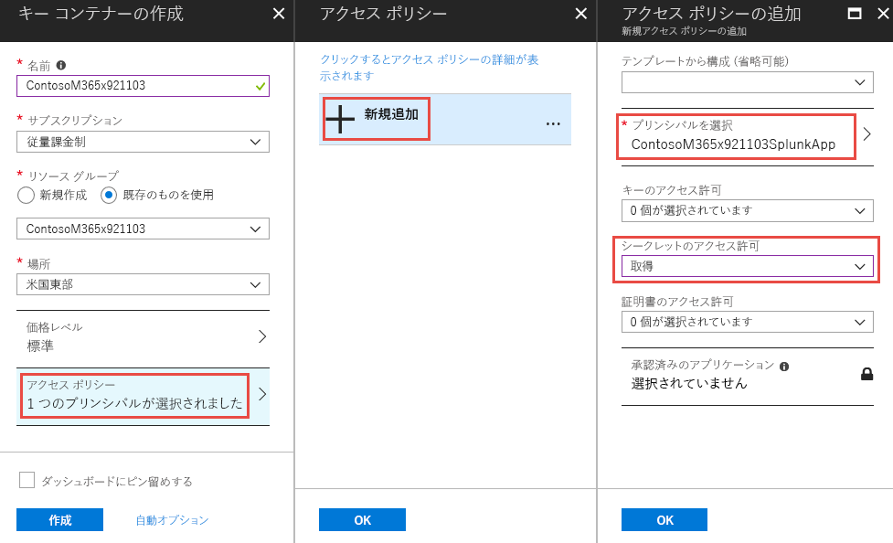
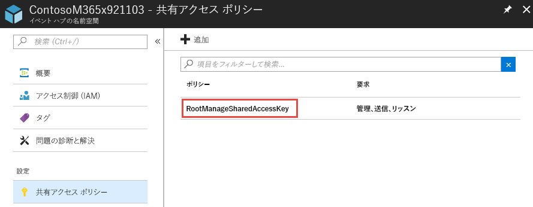

# <a name="integrate-microsoft-graph-security-api-alerts-with-your-siem-using-azure-monitor"></a>Azure Monitor を使った Microsoft Graph セキュリティ API の警告と SIEM の統合

  Microsoft Graph セキュリティ API は、プロバイダーとして知られるすべてのマイクロソフトのセキュリティ製品のセキュリティの警告を、1 つの REST エンドポイントで管理できるようにします。 組織によっては、Azure Monitor によって Azure 固有のログ データが SIEM ソリューションに既に取り込まれている場合があります。 統合を簡素化するには、Microsoft Graph セキュリティ API を通じて使用可能なセキュリティの警告を、Azure Monitor を介してのサブスクリプションに対して、顧客に設定してもらうこともできます。 Azure Monitor と SIEM ソリューションの統合が既に構成されている組織では、組織のセキュリティの警告を Azure Monitor で利用できるデータに簡単に追加できます。 この記事では、この統合を有効にする手順について説明します。

Azure  Monitor は、いくつかの SIEM 製品へのコネクタをサポートしています。 SIEM のサポートされている製品の一覧は、「[監視データをイベント ハブへ送信](https://docs.microsoft.com/en-us/azure/monitoring-and-diagnostics/monitor-stream-monitoring-data-event-hubs#what-can-i-do-with-the-monitoring-data-being-sent-to-my-event-hub)」 にあります。 この記事の手順 1 と 2 の指示は、イベント ハブ経由での消費をサポートするすべての Azure Monitor のコネクタに言及しています。 この記事では、Splunk SIEM コネクタのエンド  ツー エンドの統合について説明します。

この統合プロセスは、以下の手順から構成されます。

1. [テナントのセキュリティの警告を受信するように Azure とイベント ハブをセットアップする](#step-1-set-up-an-event-hubs-namespace-in-azure-to-receive-security-alerts-for-your-tenant)
2. [テナントからイベント ハブにセキュリティの警告を送信するように Azure Monitor を構成する](#step-2-configure-azure-monitor-to-send-security-alerts-from-your-tenant-to-the-event-hub)
3. [Splunk がセキュリティの警告を使用できるように Splunk 向けの Azure Monitor アドオンをダウンロードしてインストールする](#step-3-download-and-install-the-azure-monitor-add-on-for-splunk-which-will-allow-splunk-to-consume-security-alerts)
4. [Splunk がイベント ハブからの読み取りに使用するアプリケーションをテナントの Azure Active Directory に登録する](#step-4-register-an-application-with-your-tenant-azure-active-directory-which-splunk-will-use-to-read-from-the-event-hub )
5. [イベント ハブのアクセス キーを格納する Azure Key Vault を作成する](#step-5-create-an-azure-key-vault-to-store-the-access-key-for-the-event-hub)
6. [イベント ハブに格納されているセキュリティの警告を使用するように Splunk のデータ入力を構成する](#step-6-configure-the-splunk-data-inputs-to-consume-security-alerts-stored-in-the-event-hub)

上記の手順を完了すると、Splunk Enterprise はテナントにライセンスされたすべての Microsoft Graph 統合セキュリティ製品から出力されるセキュリティの警告を使用します。 ユーザーがライセンスを取得した新しいセキュリティ製品もこの接続を使用して同じスキーマで警告を送信するため、追加の統合作業は発生しません。

## <a name="step-1-set-up-an-event-hubs-namespace-in-azure-to-receive-security-alerts-for-your-tenant"></a>手順 1: テナントのセキュリティの警告を受信するように Azure の Event Hubs 名前空間をセットアップする

最初に、Microsoft Azure Event Hubs 名前空間とイベント ハブを作成する必要があります。 この名前空間とイベント ハブは、組織のすべてのセキュリティの警告の送信先になります。 Event Hubs 名前空間は、同じアクセス ポリシーを共有するイベント ハブの論理的なグループです。 Event Hubs 名前空間とイベント ハブを作成するときは、以下の点に注意してください。

- 特に同じイベント ハブを介して他の Azure 監視データを送信する場合は、Standard Event Hubs 名前空間を使用することをお勧めします。
- 通常、必要なスループット ユニットは 1 つだけです。 使用量の増加に合わせてスケールアップする必要がある場合は、名前空間のスループット ユニットの数を後からいつでも手動で増やすことができ、自動インフレを有効にすることもできます。
- スループット ユニットの数によって、イベント ハブのスループットを増やすことができます。 パーティションの数によって、多くのコンシューマー間で使用量を並列化できます。 1 つのパーティションで最大 20 MBps (1 秒あたり約 20,000 メッセージ) に対応します。 データを使用するツールによっては、複数のパーティションからの使用がサポートされない場合があります。 設定するパーティションの数がわからない場合は、4 個のパーティションから始めることをお勧めします。
- イベント ハブでのメッセージのリテンション期間は、7 日間に設定することをお勧めします。 これにより、コンシューマー ツールの停止期間が 1 日を超えた場合でも、中断した時点 (最大 7 日前のイベントまで) をツールで選択できるようになります。
- イベント ハブの既定のコンシューマー グループを使用することをお勧めします。 2 つの異なるツールが同じイベント ハブの同じデータを使用しない限り、追加のコンシューマー グループを作成したり、別のコンシューマー グループを使用したりする必要はありません。
- 通常、イベント ハブのデータを使用するマシンのポート 5671 と 5672 を開く必要があります。

[Event Hubs のよく寄せられる質問](https://docs.microsoft.com/en-us/azure/event-hubs/event-hubs-faq)も参照してください。

1. [Azure Portal](https://portal.azure.com/) にログオンし、画面左上の **[リソースの作成]** を選択します。

    ![[リソースの作成] の画像](../concepts/images/create-resource.png)

2. **[モノのインターネット (IoT)]** を選択し、**[Event Hubs]** を選択します。

    ![[Event Hubs] の画像](../concepts/images/event-hubs.png)

3. **[名前空間の作成]** で、名前空間の名前を入力します。 名前空間の名前が使用できることを確認した後、価格レベル (Basic または Standard) を選択します。 さらに、Azure サブスクリプション、リソース グループ、およびリソースを作成する場所を選択します。 **[作成]** を選択して名前空間を作成します。 システムによるリソースのプロビジョニングが完了するまで、数分かかることがあります。

    ![[名前空間の作成] の画像](../concepts/images/create-namespace.png)

## <a name="step-2-configure-azure-monitor-to-send-security-alerts-from-your-tenant-to-the-event-hub"></a>手順 2: テナントからイベント ハブにセキュリティの警告を送信するように Azure Monitor を構成する

Azure Monitor を使った組織のセキュリティの警告のストリーミングを有効にする操作は、Azure Active Directory (Azure AD) テナント全体で 1 回だけ実行します。 セキュリティ API がライセンスされ、有効になっているすべての製品が Azure Monitor にセキュリティの警告を送信し始め、Azure Monitor がコンシューマー アプリケーションにデータをストリーミングし始めます。 組織にライセンスされ、配置された追加のセキュリティ API 対応製品は、この同じ Azure Monitor 構成を使用してセキュリティの警告を自動的にストリーミングします。 組織内で追加の統合作業は発生しません。

セキュリティの警告は、通常は組織内のセキュリティ対応担当者と全体管理者だけが表示できる高い権限を持つデータです。 このため、テナントのセキュリティの警告と SIEM システムの統合を構成する手順では、Azure AD の全体管理者アカウントが必要です。 このアカウントは、セットアップ中に組織のセキュリティの警告を Azure Monitor に送信するように要求するときに 1 回だけ使用されます。

> **注:** この時点では、Azure Monitor の [診断設定] ブレードは、テナントレベルのリソースの構成をサポートしていません。 Microsoft Graph セキュリティ API の警告はテナント レベルのリソースで、Azure のリソース マネージャーの API を使用して、組織のセキュリティの警告の消費をサポートするように、Azure Monitor を構成する必要があります。

1. Azure サブスクリプションで "microsoft.insights" (Azure Monitor) をリソース プロバイダーとして登録します。  
> **注:** "Microsoft.SecurityGraph" (Microsoft Graph のセキュリティ API) は、前述のようにテナント レベルのリソースですので、Azure サブスクリプションのリソース プロバイダーとしては登録しないでください。 テナント レベルの構成は後述する #6 で扱います。

2. Azure Resource Manager API を使用して Azure Monitor を構成するには、[ARMClient](https://github.com/projectkudu/ARMClient) ツールを入手します。 このツールは、コマンド ラインから Azure Portal に REST API 呼び出しを送信するために使用されます。

3. 次のような診断設定要求の JSON ファイルを準備します。

    ``` json
    {
      "location": "",
      "properties": {
        "name": "securityApiAlerts",
        "serviceBusRuleId": "/subscriptions/SUBSCRIPTION_ID/resourceGroups/RESOURCE_GROUP/providers/Microsoft.EventHub/namespaces/EVENT_HUB_NAMESPACE/authorizationrules/RootManageSharedAccessKey",
        "logs": [
          {
            "category": "Alert",
            "enabled": true,
            "retentionPolicy": {
              "enabled": true,
              "days": 7
            }
          }
        ]
      }
    }
    ```

    JSON ファイル内の値を次のように置き換えます。

     **SUBSCRIPTION_ID** は、組織からセキュリティの警告を送信するときに使用するリソース グループとイベント ハブの名前空間をホストする Azure サブスクリプションのサブスクリプション ID です。

     **RESOURCE_GROUP** は、組織からセキュリティの警告を送信するときに使用するイベント ハブの名前空間を含むリソース グループです。

     **EVENT_HUB_NAMESPACE** は、組織からセキュリティの警告を送信するときに使用するイベント ハブの名前空間です。

     **“days”:** は、イベント ハブにメッセージを保持する日数です。

4. ARMClient.exe を起動するディレクトリに、このファイルを JSON 形式で保存します。 たとえば、ファイル名を **AzMonConfig.json** とします。

5. 次のコマンドを実行して ARMClient ツールにサインインします。 全体管理者アカウントの資格情報を使用する必要があります。

    ``` shell
    ARMClient.exe login
    ```

6. 次のコマンドを実行して、セキュリティの警告をイベント ハブの名前空間に送信するように Azure Monitor を構成します。 これにより、名前空間の内部にイベント ハブが自動的にプロビジョニングされ、セキュリティの警告のイベント ハブへのフローが開始されます。 設定名 (この例では **securityApiAlerts**) が JSON ファイルの **name** フィールドに設定した設定名と一致することを確認してください。

    ``` shell
    ARMClient.exe put https://management.azure.com/providers/Microsoft.SecurityGraph/diagnosticSettings/securityApiAlerts?api-version=2017-04-01-preview  @".\AzMonConfig.json"
    ```

7. 設定が正しく適用されていることを確認するには、次のコマンドを実行して、出力が JSON ファイルの設定と一致していることを確認します。

    ``` shell
    ARMClient.exe get https://management.azure.com/providers/Microsoft.SecurityGraph/diagnosticSettings/securityApiAlerts?api-version=2017-04-01-preview
    ```
8. ARMClient ツールを終了します。 これで、イベント ハブにテナントのセキュリティの警告を送信するための Azure Monitor の構成が完了しました。

## <a name="step-3-download-and-install-the-azure-monitor-add-on-for-splunk-which-will-allow-splunk-to-consume-security-alerts"></a>手順 3: Splunk がセキュリティの警告を使用できるように Splunk 向けの Azure Monitor アドオンをダウンロードしてインストールする

1. この統合は、Splunk のエンタープライズ環境をサポートするだけです。
2. [Splunk 向けの Azure Monitor アドオン](https://github.com/Microsoft/AzureMonitorAddonForSplunk)をダウンロードしてインストールします。 インストール手順の詳細については、「[インストール](https://github.com/Microsoft/AzureMonitorAddonForSplunk/wiki/Installation)」 をご覧ください。 **Splunk バージョン 1.2.9 またはそれ以降の Azure Monitor アドオンだけがサポートされています。**
3. アドオンを正常にインストールした後、「[Azure モニターのアドオンの構成 wiki](https://github.com/Microsoft/AzureMonitorAddonForSplunk/wiki/Configuration-of-Splunk )」 で説明した構成手順に従って、Splunk を構成します。
4. アドオンのインストール手順に示されているように、アドオンは Splunk Web の [App の管理] ページで有効/無効を切り替えることで動作します。 または、Splunk を再起動します。

## <a name="step-4-register-an-application-with-your-tenant-azure-active-directory-which-splunk-will-use-to-read-from-the-event-hub"></a>手順 4: Splunk がイベント ハブからの読み取りに使用するアプリケーションを、テナントの Azure Active Directory に登録する

Splunk では、必要なアクセス許可と、Azure Monitor イベント ハブへの認証に必要なアプリケーションの資格情報を付与されるために、組織の Azure Active Directory 内でのアプリケーションの登録が必要です。

1. Azure Portal で、**[アプリの登録]** に移動して **[新しいアプリケーションの登録]** を選択します。

    ![[アプリの登録] の画像](../concepts/images/app-registration.png)

2. アプリケーションの名前を選択し、種類として **[Web アプリ / API]**、サインイン URL として **`http://localhost`** をそれぞれ選択します。 その後、**[作成]** を選択します。

    

3. アプリケーションが作成されたら、**[アプリケーション ID]** を後で Splunk のデータ入力の構成時に使用するためにコピーして保存します。 その後、アプリケーション設定に移動して **[キー]** を選択します。

    

    これにより、アプリケーション シークレットと呼ばれる新しいキーを生成できます。 キーが生成されたら、**[アプリケーション シークレット]** を後で Splunk のデータ入力の構成時に使用するためにコピーして保存します。

4. イベント ハブと組織のセキュリティの警告を含む Azure サブスクリプションで、アプリケーションに**閲覧者**のロールを付与します。

    

    サブスクリプションを選択し、**[アクセス制御 (IAM)]** を選択します。 **[追加]** を選択してアクセス許可を追加します。 アプリケーションを選択し、アプリケーションに対して **[閲覧者]** の **[ロール]** を選択します。

    

    **[保存]** を選択して、アプリケーションに付与したアクセス許可をサブスクリプションに追加します。

## <a name="step-5-create-an-azure-key-vault-to-store-the-access-key-for-the-event-hub"></a>手順 5: イベント ハブのアクセス キーを格納する Azure Key Vault を作成する

Azure Key Vault は、アプリケーションが実行時に使用する ID、パスワード、証明書などのシークレットを格納するために使用されます。 この手順では、Splunk が組織のセキュリティの警告を含む Azure イベント ハブに接続してセキュリティの警告を読み取るのに必要なシークレットを格納する Azure Key Vault を作成します。

1. Azure Portal で、**[キー コンテナー]** に移動して **[追加]** を選択します。

    

2. 新しいキー コンテナーの作成時に、**[アクセス ポリシー]** を選択して、手順 4 で登録したアプリケーション用の新しいアクセス ポリシーを追加します。 シークレットの **[取得]** アクセス許可をアプリケーションに付与します。 これで、Splunk が登録済みのアプリケーションとして動作し、この Azure Key Vault に格納されているキー (シークレット) にアクセスできるようになります。

    

    **[作成]** を選択して、新しい Azure Key Vault の作成を完了します。

3. キー コンテナー内に新しいシークレットを生成して、イベント ハブの名前空間へのアクセス キーを格納します。 最初に、イベント ハブの名前空間を開き、**[共有アクセス ポリシー]** を選択して、イベント ハブの名前空間へのアクセス キーを取得します。 リストから **RootManageSharedAccessKey** ポリシーを選択し、リストから**主キー**をコピーします。

    

4. キー コンテナーを開き、**[シークレット]** を選択します。 **[生成/インポート]** を選択して、キー コンテナーに新しいシークレットを追加します。 イベント ハブの名前空間 **RootManageSharedAccessKey** の**主キー**を貼り付けます。

    

5. シークレットが作成されたら、シークレットを選択して **[シークレットのバージョン]** をコピーします。 これは、手順 6 で Splunk のデータ入力を構成するときに使用されます。

    

## <a name="step-6-configure-the-splunk-data-inputs-to-consume-security-alerts-stored-in-the-event-hub"></a>手順 6: イベント ハブに格納されているセキュリティの警告を使用するように Splunk のデータ入力を構成する

セットアップ プロセスを完了する最後の手順では、前の手順で作成したイベント ハブ、アプリケーション、およびシークレットを利用するように Splunk のデータ入力を構成します。

1. [Splunk の構成](https://github.com/Microsoft/AzureMonitorAddonForSplunk/wiki/Configuration-of-Splunk)の説明に従って Splunk のデータ入力を開き、Azure Monitor アドオン用に構成します。 **[設定]** および **[データ入力]** に移動します。 **[Azure Monitor 診断ログ]** を選択します。
2. **[新規]** を選択し、前の手順で取得した値を使用してすべての必須フィールドに入力します。 次の図では、すべての必須フィールドにこの記事で使用した例の値が入力されています。

    

3. **[次へ]** を選択すると、Azure Monitor から取り込まれた組織のセキュリティの警告の検索が開始されます。

## <a name="optional-use-splunk-search-to-explore-data"></a>(オプション) Splunk の検索を使用したデータの探索

Azure モニター Splunk プラグインを設定すると、Splunk のインスタンスにより、構成されたイベントのハブからのイベントの取得が開始されます。 既定では、splunk は、検索を可能にするために、Microsoft Graph セキュリティ警告スキーマの各プロパティをインデックスします。

Microsoft Graph セキュリティ警告を検索するか、ダッシュ ボードを作成するか、または検索クエリに Splunk の警告を設定するには、[アプリケーション] -> [Splunk 内でアプリケーションを検索およびレポート] へ移動します。

**例**:<br/>
Graph のセキュリティの警告を検索してみてください。

- 検索バーに `sourcetype="amdl:securitygraph:alert"` を入力すると、グラフ セキュリティ API を通じてすべての警告が表示されます。 右側には、Azure Monitor ログの最上位レベルのプロパティが表示され、Graph のセキュリティ警告が  [プロパティ] フィールドの下に表示されます。<br/>
- 左側のウィンドウには、選択したフィールドと関心のあるフィールドが表示されます。 選択したフィールドを使用してダッシュ ボードまたは Splunk の警告を作成することができます。また、選択したフィールドを右クリックして追加または削除することもできます。  
> **注:** 次の検索クエリに示すように、必要に応じて検索を制限できます。 例では、Graph のセキュリティ警告を、Azure のセキュリティ センターからの重要警告によりフィルター処理します。 表示する選択フィールドとして、`eventDatetime`、`severity`、`status`、および `provider` も使用しました さらに上級の検索語句については、「[splunk 検索チュートリアル](http://docs.splunk.com/Documentation/Splunk/7.1.2/SearchTutorial/WelcometotheSearchTutorial)」 をご覧ください。

 
> 検索クエリー: `sourcetype="amdl:securitygraph:alert" "properties.vendorInformation.provider"=ASC "properties.severity"=High | rename properties.eventDataTime as eventDateTime properties.severity as severity properties.vendorInformation.provider as provider properties.status as status`

Splunk では、画面の右上にある [名前を付けて保存] のメニュー オプションを使用して、検索結果に対して複数の操作を行うことができます。 検索フィルターに基づいて、レポート、ダッシュ ボード パネル、またはアラートを作成することができます。
前のクエリに基づいて、イベント ストリームのあるダッシュ ボードの例を次に示します。 Microsoft Graph のサイトの詳細にさらにアクセスするために、各イベントにドリルダウン リンクを追加することができます。 「 [Splunk のドリル ダウンのマニュアル](http://docs.splunk.com/Documentation/Splunk/7.1.2/Viz/DrilldownIntro)」 をご覧ください。

 

または、タイムライン グラフとしてダッシュ ボードを作成することができます。

 

詳細については、「[Splunk の検索とレポートのチュートリアル](http://docs.splunk.com/Documentation/Splunk/7.1.2/SearchTutorial/WelcometotheSearchTutorial)」 をご覧ください。